### 1. 프로젝트 소개
#### 1.1. 개발배경 및 필요성
- 개발배경 <br/>
  
  > [한국경제연구원 관련 기사](https://www.yna.co.kr/view/AKR20230616069600002) 대한민국의 고령화 문제가 심화되고 있습니다. 한국경제연구원 자료에 따르면 최근 10년 OECD 평균 고령인구 연평균 증율은 2.6%이지만 한국은 4.4%의 증가율을 보여줍니다. 베이비붐의 사회 은퇴 시기와 더불어, 저출산이 지속되며 대한민국의 노인 인구 증가 속도는 OECD 회원국 중 가장 빠른 것으로 나타납니다. 2024년 기준 대한민국의 65세 이상 고령 인구는 973만명으로, 전체 인구의 19%에 달하고, 고령 인구는 지속적으로 증가하여 '36년에는 1574만명이 될 것으로 통계청은 예상했습니다. 특히, 우리 부산 광역시의 경우 이미 고령 인구 비율이 60%를 초과한 초고령사회에 진입했으며, 한국고용정보원에서 발간한 자료에 따르면, 부산광역시의 고령화는 다른 어느 지자체들보다도 빠르게 진행되고 있음을 나타냅니다.


- 개발필요성
  > 이와 같은 노인 인구 증가와 더불어 독거 노인 우울증, 자살 그리고 노인 실종과 같은 노인 돌봄 공백 문제 역시 커져만 가고 있습니다. 신체적 노화로 인해 그 능력이 다소 떨어지는 노인의 경우, 안정된 생활을 위해 주변 가족와 사회의 도움이 절실합니다. 그럼에도, 사회의 여러 변화로 돌봄 공백 문제는 심화되고 있는 현실입니다. 
 
    1. 사회적 비용 증가
        > [통계청](https://www.index.go.kr/unity/potal/main/EachDtlPageDetail.do?idx_cd=1430)에서 발표한 노년부양비(총인구중 생산가능인구에 대한 고령인구의 백분비)의 경우, 2010년에는 생산가능인구 6.7명이 노인 1명을 부양하였으나, '18년에는 5.1명, '30년에는 2.6명, '50년에는 1.3명으로 지속적으로 증가할 것입니다.
        > > [통계청 관련 기사](https://www.bokjitimes.com/news/articleView.html?idxno=31915) 노년 총 부양비의 경우, 2020에는 38.7명으로 OECD 회원국 중 가장 낮았지만 2030년부터 가파른 증가가 예상된다. 이로인해 2070년에는 116.8명으로 OECD 회원국 중 가장 높아질 것으로 예상됩니다. 생산연령인구 비중보다 고령화 인구 비중이 커진다는 이야기입니다. 이로 인해 노인인구 부양을 위한 생산가능인구의 조세, 사회보장비와 같은 사회적 비용의 증가는 불가피할 예정입니다. 추가로 이로 인한 세대 간 갈등까지 발생할 수 있습니다.

    2. 노인 돌봄 인력의 부족 <br/>
       
       > 통계청에 따르면, 노인 돌봄 인력의 공급 부족은 이미 2022년에 19만명에 달했고, '42년에는 최대 155만명의 돌봄 인력 공급 부족이 발생할 것으로 분석했습니다. 그에 따른 노인 돌봄에 필요한 서비스의 공백 역시 크게 증가할 것으로 예상됩니다.
          

    4. 복지 사각 지대 증가
        > 1인 가구의 증가로 복지 사각지대가 점점 늘어나고 있습니다. 특히나 독거노인의 비율은 과거부터 꾸준히 증가하여, 현재에는 노인 5명 중 1명이 독거노인, 즉 복지 사각지대에 놓여있다고 [통계청](https://www.index.go.kr/unify/idx-info.do?idxCd=8039)은 발표했습니다.
    
    위와 같은 돌봄 공백의 문제를 단순히 통계로 뿐만 아니라, 일상에서도 접할 수 있습니다. 바로 안내문자입니다. 부산에서도 매일매일 실종된 고령의 노인을 찾는다는 안내문자를 받아볼 수 있습니다. 
    > [해운대구 주민인 노영찬씨(남,76세)를 찾습니다-163cm,60kg,파란색티,검정바지,검정신발,흰머리 부산경찰청](https://www.safekorea.go.kr/idsiSFK/neo/sfk/cs/sfc/dis/disasterMsgView.jsp?menuSeq=679&md101_sn=223118)
  
    이렇듯 나날이 심화되고 있는 노인 돌봄 공백의 문제를 SW를 통해 완화시키고 해결하고자 합니다.
  

#### 1.2. 개발목표 및 주요내용
- 개발목표<br>
  **‘노인 돌봄 공백 해소’**
   > 해당 서비스의 개발 목표는 바로 노인 돌봄 공백 해소입니다. 노인 돌봄 매칭 플랫폼을 앱 형식으로 개발하여, 간단한 돌봄 서비스를 제공하는 것입니다. 이는 우리 부산대학교에서 진행하고 있는 여러 멘토링 시스템과 유사합니다. 전문 간병 인력이나 사회 복지 인력을 대체 및 보조 가능한 대학생 위주의 청년층을 플랫폼에 유입시켜, 간단한 돌봄 서비스를 제공하도록 하는 것입니다. 서비스 개발을 통해 노인 돌봄 공백 해소 이외에도 청년층의 사회 복지 참여를 독려하고 세대 간의 이해를 증진을 통한 갈등 완화에도 효과를 가질 것으로 기대합니다.

  > 또한, 위와 같은 의도를 담아, 이러한 의도를 담아 앱의 이름을 '따스하게'의 경상도 방언인 '따시게'로 정했습니다. 메인 테마 색상은 따뜻하고 눈에 편한 붉은색을 사용했으며, 이름의 끝 음절인 '-게'를 활용해 메인 캐릭터로 붉은 게를 설정했습니다. 이 캐릭터는 바다의 도시 부산을 떠올리게 하며 앱의 포근하고 따스한 이미지를 전달하는 역할을 합니다.

- 주요내용
  > 우선 서비스 내에는 두 가지 주요 유저 타입이 존재합니다. 바로 돌봄 서비스를 제공받는 노인층과 돌봄 서비스를 제공하는 대학생 중심의 청년층입니다. 따라서 서비스 내에서 노인층을 시니어로, 청년층을 메이트로 정의하여 다음과 같은 주요 서비스를 제공합니다. 
  1. 돌봄 매칭 서비스:
     > 시니어가 필요로 하는 돌봄 서비스를 작성하여 메이트를 모집할 수 있도록 하는 서비스입니다. 플랫폼의 역할을 하는 핵심적인 기능이며, 메이트는 시니어가 올린 공고에 신청을 넣어 돌봄 활동을 개시할 수 있도록 합니다.
  2. 리워드 서비스:
     > 메이트는 돌봄 서비스 활동을 완료한 후 크레딧을 지급받게 됩니다. 해당 크레딧을 후에 연계된 기업과 대학교가 제공하는 여러 리워드와 교환할 수 있게끔 하여, 메이트의 플랫폼 유입을 독려하여 최종적으로 플랫폼 선순환을 이끌어냅니다.
  3. 피드백 서비스:
     > 플랫폼 내 전체적인 서비스 질을 높이기 위한 서비스입니다. 유저 간 피드백 뿐만 아니라 사용자의 플랫폼에 대한 피드백을 가능하도록 하여 서비스 신뢰도와 질을 높일 수 있도록 합니다. 
  4. 인증 서비스:
     > 서비스 안정도를 높이기 위한 서비스입니다. 실제 돌봄 활동를 위해서는 사용자 간의 신뢰가 우선되어야 합니다. 그에 따른 사용자에 대한 인증을 포함하며, 크레딧 및 리워드 시스템에 대한 신뢰성을 높이기 위한 돌봄 활동에 관한 인증이 포함된다. 또한, 해당 서비스에는 메이트가 본인의 활동 내역을 인증할 수 있는 서비스 역시 포함됩니다. 
  5. 교육 동영상 서비스: 
     > 플랫폼에 사용에 대한 교육 영상을 제공하는 서비스입니다. 
  6. 여러 부가 서비스:
     > 플랫폼 이용에 편의성을 제공하는 여러 부가 서비스가 제공됩니다.
      
      


#### 1.3. 세부내용
  1. 돌봄 매칭 서비스
      > 플랫폼의 가장 핵심적인 온라인 매칭 서비스를 제공합니다. 시니어가 작성한 공고를 바탕으로 메이트와 매칭될 수 있도록 하여, 오프라인 돌봄 서비스 활동이 실제로 이루어지기 전까지, 시니어와 메이트간 온라인 매칭 서비스가 제공됩니다. 시니어 측은 간단한 캘린더 형태의 위젯으로 공고를 작성할 수 있고, 메이트는 여러 필터를 활용하여 공고를 탐색하고 매칭을 신청하는 것이 가능합니다. 매칭을 위해 상호 간의 리뷰, 활동 기록 등의 확인이 가능합니다.
        
      - 시니어의 돌봄 공고 게시
         - 공고글 작성
          > 공고 작성 시, 필요한 돌봄 활동의 종류, 시작 및 종료 시간, 그 외 시니어 프로필이 상세히 기재되어 메이트가 신청을 넣는데 도움이 되도록 합니다.
         - 시니어 사용 편의성
          > 시니어가 직관적으로 서비스를 이용할 수 있게끔, 시니어를 위한 UX 및 UI가 제공됩니다. UX적인 측면에서, 홈 페이지에서 모든 페이지로 이동이 가능하게끔 구성하고, 탭바 및 네이게이션 바를 적극 활용하여 페이지 간의 이동의 직관성을 높이고, 전체적인 폰트 크기 키우고, 눈에 잘 띄는 붉은 색감을 활용하여 디자인하였습니다.
            
       - 메이트의 공고 신청
          - 공고글 탐색
          > 공고 탐색 시, 메이트는 원하는 공고를 쉽게 찾을 수 있도록 날짜, 지역과 관련된 여러 필터를 활용할 수 있습니다. 뿐만 아니라 게시글 정렬이 가능하도록 하여 탐색에 대한 편의성을 높입니다. 공고글 탐색 시, 시니어가 작성한 프로필과 여러 리뷰, 기록 등을 활용할 수 있습니다.

  2.    리워드 서비스
        > 메이트의 플랫폼 참여를 독려하기 위한 주요 서비스입니다. 돌봄 활동을 마친 메이트가 크레딧을 지급받아, 해당 크레딧을 여러 리워드로 교환할 수 있습니다. 리워드는 서비스와 연계된 기업 측의 특정 제품이나, 기프티콘 등이 있고, 메이트가 대학생 중심의 청년층임을 감안하여, 학교 측에서 제공하는 장학금의 형태가 될 수 있습니다. 최종적으로 메이트의 돌봄 서비스와 플랫폼 참여를 이끌어내기 위한 서비스입니다. 메이트는 특정 리워드 공고에 신청을 넣고 리워드를 제공 받으며, 크레딧이 차감됩니다.
    
  3.    피드백 서비스
        > 플랫폼에 대한 피드백 및 사용자 간의 피드백이 가능하도록 하여, 전체적인 플랫폼 내의 서비스 질과 신뢰성을 향상시키기 위한 서비스입니다. 유저 간의 리뷰 서비스, 활동 보고서, 문의하기(고객센터) 서비스 등이 포함됩니다.
        
        - 유저 간 피드백
          > 별점 기반 사용자 평가: 활동을 마친 후 서로에 대해 별점(1점~5점)을 부여합니다. 별점은 활동에서의 상호 간의 태도, 시간 준수 여부 등을 기준으로 평가됩니다.
          > 활동 보고서 작성: 돌봄 활동을 하며 발생했던 사건이나, 특별한 경험, 개선사항 등을 바탕으로 활동 보고서를 작성할 수 있습니다.
       
        - 플랫폼 피드백
          > 이외에도 플랫폼 피드백을 위한 문의하기 서비스가 제공됩니다. 직접적으로 플랫폼에 대한 불편점이나, 요구 사항 등을 플랫폼 운영진 측에 전달할 수 있습니다. 

  4. 인증 서비스
        > 활동을 무사히 마쳤음에 대한 인증, 회원 가입 시의 인증, 본인 활동 내역에 관한 인증을 포함하며, 학생증과 같은 신뢰 가능한 인증을 통해 서비스와 유저 간의 신뢰도를 높일 수 있습니다. 플랫폼 서비스라는 특성상, 대부분의 서비스가 신뢰를 바탕으로 이루어지고 있기 때문에 필수적인 서비스입니다.
      
        - 활동에 대한 인증
            > 활동 시작 및 종료 시에 인증 절차가 진행됩니다. 돌봄 서비스가 성공적으로 개시, 종료되었음을 증명하기 위한 인증이며, 해당 인증에는 얼굴 인식 AI를 활용하여, 사진 한 장으로 시니어와 메이트가 돌봄 활동을 위해 대면으로 만났음을 인증할 수 있습니다.
        
        - 메이트의 가입 인증
            > 메이트의 경우, 대학생을 중심으로 하기에, 학교 학생증을 통해 인증을 할 수 있도록 합니다. 이를 통해, 저택이나, 특정 장소로 시니어에 대한 돌봄 활동을 해야 하는 메이트 유저의 신뢰성을 확보하는데 도움을 줍니다. 
            
        - 활동 내역에 관한 인증
            > 메이트는 본인이 플랫폼 내에서 활동했던 기록에 대한 기록물을 인쇄하여 증빙 자료로 활용이 가능합니다. 이를 활용하여 메이트가 향후 사회 활동 기여에 대한 증명이 가능할 것이며, 취업 혹은 여러 구직 활동 등에 사용할 수 있을 것으로 기대합니다.
            
  5. 교육 동영상 서비스
        > 플랫폼 진입 전 필수적으로 이수해야 하는 교육 서비스입니다. 플랫폼 이용 시 행동 규범과 주의 사항을 이해하고, 미 준수 시 발생하는 문제점을 사전에 인지하도록 돕기 위해 설계되었습니다.
        
  6. 여러 부가 서비스
        > 플랫폼 이용에 편의성을 더하기 위한 채팅, 알림, 기존 복지 정보 제공 등의 부가 서비스가 존재합니다. 기능과 직접적인 부분이기에 향후 기능 명세에 자세히 서술합니다.


<br/>

#### 1.4. 기존 서비스(상품) 대비 차별성
1. 선택 가능한 봉사자와 서비스
> [금정구종합사회복지관의 재가노인지원서비스센터 지원서비스](https://www.kumjungswc.or.kr/center/sub1.php)
>  - 기존 기관 서비스는 식사배달, 세탁등 제한된 프로그램과 자원봉사자만을 제공했지만, 이 플랫폼에서는 이용자가 희망하는 서비스와 봉사자를 직접 선택할 수 있습니다.
>  - 이를 통해 시니어 이용자의 개별적인 요구사항을 더욱 효과적으로 충족시킬 수 있습니다.

2. 간소화된 심사 절차
> [금정구 노인맞춤돌봄서비스 지원사업 대상 심사](https://www.geumjeong.go.kr/index.geumj?menuCd=DOM_000000126005001004)
> - 기존 기관 서비스는 노인장기요양보험 등급, 기초생활수급자와 같은 조건으로 서비스 적격 대상자를 구분한다. 또한, 돌봄 서비스 이용 신청할 경우, 구청->기관->대상자 심사->돌봄 서비스 방문이라는 신청부터 제공까지 3~4주가 걸리는 까다로운 심사 절차를 거쳐야 합니다.
> - 또한, 메이트 봉사자의 경우, 상담->신청->교육 및 OT->봉사 활동이라는 복잡한 절차를 거쳐야 합니다.
>  - 이 플랫폼은 간소화된 심사 절차를 통해 다운로드부터 매칭 서비스 신청을 위한 공고 작성까지 10분이내로 신속하게 서비스를 신청, 제공받을 수 있습니다.
>  - 또한, 서비스 제공을 희망하는 청년들은 간단한 인증 심사 절차를 통해 프로그램에 참여할 수 있습니다.

3.	시간적 제약 없는 서비스
>  - 기존 기관 서비스는 중점돌봄군의 경우 월40시간 미만, 일반돌봄군의 경우 월 16시간 미만의 제한된 공공돌봄서비스 시간으로 인해 이용에 어려움이 있습니다.
>  - 이 서비스는 시니어와 메이트의 매칭, 채팅 시스템을 통해 양측이 원하는 시간을 조정하여 원하는 만큼 서비스를 이용할 수 있습니다.

4.	비용 효율성
> [기업 BAYADA 방문요양 서비스 이용요금표](https://www.geumjeong.go.kr/index.geumj?menuCd=DOM_000000126005001004)
>  - 민간 돌봄 기업 서비스의 경우 제한된 공단부담 등급별 원 한도액 초과시 시간당 24,120원을 개인이 부담해야 합니다.
>  - 산책, 스마트폰 교육등과 같은 간단한 돌봄 친구 서비스를 이용하기 위해서라도 고비용 전문 돌봄 서비스를 이용할 수밖에 없는 비용 구조는 서비스를 자주 이용하기에는 부담이 있습니다.
>  - 이 플랫폼은 봉사시간, 장학금으로 환산할 수 있는 합당한 리워드를 제공하며 이용자와 봉사자 간의 직접 연결을 통해 보다 저렴한 비용으로 서비스를 제공할 수 있습니다.

5. 청년들의 사회참여 유도
> [통계청 2022 고령자 통계](https://kostat.go.kr/board.es?mid=a10301060500&bid=10820&act=view&list_no=420896&tag=&nPage=1&ref_bid=)
> [김포신문 노년시대 관련 기사](https://www.igimpo.com/news/articleView.html?idxno=83488)
>  - 2022년 기준 우리나라의 65세 이상 고령인구는 전체 인구의 17.5%로, 계속 증가하여 2025년에는 20.6%를 기록하여 초고령사회로 진입하고, 2035년 30.1%, 2050년에는 43%를 넘어설 것으로 전망되고 있습니다.
>  - 또한, 노인 돌봄 인력의 평균 연령은 2023년 12월 기준 61.7세이며, 2027년에는 약 7만9000명이 부족할 것으로 전망되고 있습니다.
>  - 노인 돌봄 서비스 활동에 청년의 참여는 부족한 돌봄 인력을 보충하며 더 질 좋은 돌봄 서비스를 제공할 수 있습니다.
>  - 이러한 과정을 통해, 청년들과 노인들의 소통 기회 창출을 통해 청년들은 노인들의 경험과 지혜를 배우고 노인들은 청년들의 활력과 새로운 아이디어를 접할 수 있습니다. 그 결과, 세대 간 갈등을 완화하고 조화로운 사회를 구성할 수 있습니다.
>  - 또한, 청년들은 활용 가능한 시간을 할애하여 서비스를 제공하므로 1365와 연계한 봉사시간 그리고 후원 기업을 통한 장학금과 같은 합당한 보상을 받을 수 있다. 이를 통해 학업과 생계에 도움이 될 수 있습니다.

이와 같은 차별화된 장점을 통해 노인 부양 가구의 돌봄 서비스 이용 편의성과 만족도를 높일 수 있을 것으로 기대됩니다.

<br/>

#### 1.5. 사회적가치 도입 계획
1. 공공기관과의 연계
> - 신원 인증의 신뢰성 강화: 개인간의 만남이 이루어지는 서비스인 만큼, 예상치 못한 위험 상황이 발생할 수 있습니다. 공공 신원 정보 인증 데이터를 활용한 인증과정을 도입하여 개인정보 보호와 서비스의 신뢰성이 강화될 것입니다. 
> - B2G 플랫폼으로의 발전 가능성: 서비스가 발전함에 따라 B2G(Business to Government) 형식으로 금정구 노인복지관과 같은 정부 기관과의 연계를 통해 공공 서비스를 제공하는 플랫폼으로 확장될 수 있습니다. 이를 통해, 기존 공공기관 돌봄 서비스의 단점을 축소하고 장점을 확대하여 사용자가 쉽고 편리하게 이용할 수 있도록 지원할 수 있습니다.
2. 서비스 범위 확대
> - 서비스 지역 확대: 초기에는 부산대학교가 위치한 금정구를 중심으로 서비스를 제공하지만, 점차 대학가를 중심으로 서비스 범위를 확대해 나갈 계획입니다. 최종적으로는 전국 어디에서나 이용 가능한 서비스로 확장될 수 있도록 발전시킬 것입니다. <br>
> 부산광역시 금정구 → 부산광역시 전역 → 경상권 → 국내 전역
> - 돌봄 메이트 영역 확대: 신원 인증과 범죄예방을 강화하여 대학생에 한정된 메이트 활동 서비스를 만 19세 이상의 성인으로 확대함으로써, 더 넓은 사용자층을 확보하고 서비스의 활성화를 도모할 것입니다.
3. 향토기업과 지역 대학생 연결
> - 향토기업 홍보: 현행 노인 지원 서비스는 기업사회공헌의 일환으로 기금후원, 물품후원으로 진행되고 있습니다. 이와 같이 부산광역시의 향토 기업들이 서비스에 참여하여 후원할 경우 시혜적 자선활동을 넘어서 미래의 소비자이자 투자자 혹은 직원이 될 수 있는 청년들에게 선한 이미지를 남겨 전략적 투자, 그리고 가치창조가 될 수 있다. 그 결과, 기업은 공익연계 마케팅의 일환으로 지역 가치를 중시하는 기업 브랜딩을 할 수 있습니다.
> - 대학생과의 상호 이익: 지역의 대학생들은 후원 기업과의 연결을 통해 합당한 혜택을 얻을 수 있습니다. 기업의 정보에 접근하고 보다 친근하게 다가갈 수 있는 기회를 가지며 활동에 대한 보상도 받을 수 있습니다. 본 서비스는 이러한 상호작용이 선순환하여 지역사회가 상생할 수 있도록 하는 것을 목표로 합니다.
이를 통해 각각의 입장에서 얻을 수 있는 이점은 다음과 같다>.
> - 서비스에 참여하는 메이트(청년) 측은 활동을 통해 획득한 크레딧을 원하는 보상으로 교환할 수 있습니다. 또한, 관련 업종에 대한 경험과 실적을 쌓을 수 있으며, 데이터화 된 활동기록을 바탕으로 취업에 이점이 있습니다. 특히, 사회적 가치를 중시하는 기업에 어필할 수 있는 요소가 될 수 있습니다.
> - 서비스에 참여하는 시니어 측은 공공 서비스와는 별개의 다양한 맞춤형 서비스를 빠르고 효율적으로 제공받을 수 있습니다. 예를 들어, 디지털 기기 사용 지원, 동행 서비스, 건강 관리 지원 등의 개인 맞춤형 서비스가 가능해집니다.
> - 서비스에 투자하는 기업 측은 사회에 환원하는 긍정적인 이미지를 얻음과 동시에 자사를 홍보할 수 있습니다. 기업이 제공하는 제품이나 서비스와 연계하여 사회적 가치를 증대시킬 수 있습니다. 이는 소비자들로부터 긍정적인 반응을 얻는 데 기여할 수 있습니다.
> -	서비스를 통해 우리 사회는 기존의 공공 노인 복지 비용을 절감할 수 있으며 세대 간의 이해와 교류를 통해 사회적 통합을 촉진하고, 세대 간 갈등을 줄일 수 있습니다. 이는 사회 전체의 안정성과 화합에 기여할 것입니다.
<br/>

### 2.상세설계
#### 2.1. 시스템 구성도

<br/>

#### 2.2. 사용기술
2.2.1. 얼굴 인증 과정
> 
>
> 따시게 앱의 얼굴을 인식하고 특징점의 벡터값을 구하여 유사도를 산출하는 과정에 두 모델을 사용했습니다.
> 플러터 라이브러리인 google ml kit를 사용해서 얼굴을 인식하고, Tensor flow로 구현된 FaceNet 모델을 사용해서 크롭된 얼굴 이미지에서 임베딩을 추출했습니다.
> 추출된 벡터는 정방향으로 회전시켜서 회원 가입 시에 firebase database 상에 저장됩니다. 그리고 활동 중 얼굴 인증을 하는 과정에서 데이터베이스 상의 임베딩값들을 불러오고 두 얼굴 이미지의 모든 특징 벡터들의 차이를 제곱하여 모두 difference에 더하고, 마지막으로 difference의 제곱근이 distance로 산출됩니다.
> 데이터베이스 상에서 불러온 모든 회원 얼굴 임베딩값과 비교하여 산출된 distance들 중에서 가장 작은 값을 가지는 얼굴의 회원 uid와 인증 주체인 사용자의 uid가 동일한지 판별한 후, 인증 성공 여부를 반환합니다.
> 만약 distance가 1.25 이상일 때는 등록되어 있지 않은 사용자로 반환합니다.

2.2.2. 모델 선정 기준
> 얼굴 인식 및 인증 기능을 구현하기 위해 google mlt kit와 FaceNet TensorFlow모델을 사용했습니다.
> google ml kit는 얼굴 인식 기능을 제공하고 있으며, flutter와 쉽게 통합할 수 있어서 안드로이드나 ios 플랫폼 종류와 관계없이 얼굴 인식 기능을 사용할 수 있다는 장점이 있습니다.
> 또한 모바일 환경에서 얼굴 인식의 속도가 빠르고 정확도가 높고, 실시간으로 얼굴을 감지하고 추적하는데 적합하며, 지속적인 업데이트와 지원을 제공하므로 최신 기술과 보안 패치를 빠르게 적용할 수 있다는 장점이 있습니다.
> FaceNet 모델은 얼굴 이미지를 임베딩하여 매우 높은 정확도로 얼굴을 구분할 수 있으며, 오픈 소스이기 때문에 필요에 따라서 커스터마이징이 가능하고 프로젝트의 요구사항에 맞춰 모델을 수정하거나 추가적인 학습을 시킬 수 있다는 장점이 있습니다.
> 또한 FaceNet은 다른 모델들에 비해 경량화된 모델이기 때문에 모바일 환경에서도 적절한 성능을 발휘합니다. 이는 제한된 자원을 사용하는 Flutter 앱에서 중요한 요소입니다.

<br/>


### 3. 개발결과
#### 3.1. 전체시스템 흐름도
- IA(Information Architecture)
  > 전체적인 시스템 구조의 정보를 간단히 도식화하여 보여줍니다. <br/>
  

- 시스템 플로우 차트
  > 테스크의 흐름과 이에 따른 데이터 처리를 도식화하여 보여줍니다.
  <br><br>
  참고) 시스템 플로우차트 컴포넌트
  <br>
  1. 시작 단계
      > 앱의 시작단계부터 회원가입 및 로그인을 거쳐 메인화면까지 도달하는 시스템 플로우차트입니다.
      

  2. 홈페이지
      > 앱의 홈페이지에서 다룰 수 있는 공고 쓰기와 열람, 매칭 신청등을 표기한 시스템 플로우차트입니다.
      

  3. 매칭페이지
      > 주고 받은 매칭을 관리하는 매칭페이지의 시스템 플로우차트입니다.
      

  4. 매칭후 활동
      > 진행되는 매칭에 대해 보고서 작성 중심으로 작동하는 앱의 매칭후 활동 시스템 플로우차트입니다.
      

  5. 교환페이지
      > 매이트가 매칭의 보상으로 받는 크래딧을 교환하는 교환페이지의 시스템 플로우차트입니다.
      

  6. 서비스페이지
      > 시니어가 받을 수 있는 유용한 서비스 정보를 모아서 손쉽게 볼 수 있는 서비스페이지의 시스템 플로우차트입니다.
      
  
  7. 채팅페이지
      > 매칭등에 필요한 채팅기능을 담당하는 채팅페이지의 시스템 플로우차트입니다.
      

  8. 부가기능
      > 앱의 다양한 부가기능들을 정리한 부가기능 시스템 플로우차트입니다.
      
    <br>

- 유저 플로우차트
  > 시니어와 메이트 2가지 타입의 유저가 앱을 직접 사용했을 때의 행동흐름을 도식화하여 보여줍니다.
  1. 회원가입 유저 플로우차트
      > 유저타입별 회원가입시 행동흐름을 보여주는 플로우차트입니다.
      <br>
  2. 매칭과 활동 유저 플로우차트
      > 유저타입별 매칭과 활동을 진행시 행동흐름을 보여주는 플로우차트입니다.
      
  <br>
  

<br/>

#### 3.2. 기능설명
##### `3.2.1. 회원가입 페이지`

<br>

- 시니어와 케어메이트 두가지의 회원유형 중 한가지를 선택하여 회원가입을 진행합니다.(시니어는 노인, 케어메이트는 대학생을 의미)


<br>

- 두번째 화면에서 어떤 종류의 활동을 원하는지 혹은 제공할 수 있는지 선택합니다.


<br>

- 세번째 화면에서 거주지역 또는 활동지역과 상세주소를 입력합니다.


<br>

- 네번째 화면에서 정면에서 촬영된 얼굴 사진을 업로드 합니다. 이후 이름과 기타 정보들을 기입합니다.


<br>

- (메이트 작성사항)학교이름과 학과를 작성한 뒤 학생증 인증을 실시합니다. 학생증 인증이 되어있지 않으면 추후 매칭 신청이 불가합니다.


<br>

- (메이트 작성사항) 활동가능 시간을 입력합니다. 각 요일과 시간대를 자신이 활동가능한 시간에 맞춰 작성합니다.
- (시니어 작성사항) 본인이 키우는 반려동물이나 홈캠여부, 질병여부등을 작성합니다.


<br>

- 모든 정보를 입력한 후 자신이 지금까지 입력한 정보를 모아 볼 수 있습니다.


<br>

- 다시 확인 후 이상이 없다면 마지막으로 이메일과 비밀번호를 입력해 회원가입을 완료합니다.

<br>

---

<br>

##### `3.2.2. 로그인 페이지`


- 이메일과 비밀번호를 입력하고 '로그인' 버튼을 클릭합니다.


- 가입 후 첫 로그인 시에 약 2분간의 교육영상을 필수 시청해야 합니다. 교육 영상 시청 후에 '홈'화면으로 넘어갑니다.

<br>

---

<br>

##### `3.2.3. 메인 페이지`
##### `가. 공고 작성 페이지 이동`
>

  - 클릭시 공고 작성 페이지로 넘어갑니다.
  - 시니어에게만 표시되는 버튼입니다.

##### `나. 공고 작성`


  - 상단 프로필카드와 함께 공고 게시 캘린더를 보여줍니다.
  - 공고 게시 캘린더에서 날짜를 선택한 후 활동종류, 시작시간, 종료시간을 입력하여 공고를 작성합니다.


  - 공고를 모두 작성한 뒤 공고 올리기 버튼을 누르면 공고가 등록됩니다.
  - 공고가 등록되면 캘린더의 해당 날짜칸에 빨간점으로 표시됩니다.
  - 공고가 등록되면 캘린더 아래의 입력창은 게시된 공고를 확인할 수 있는 상태창으로 바뀝니다.


  - 상태창 아래의 공고 내리기 버튼을 이용하여 공고를 삭제할 수 있습니다.


  - 공고 게시 캘린더 아래에는 공고에 기재될 시니어의 신상정보가 표시됩니다.

##### `다. 공고 목록`
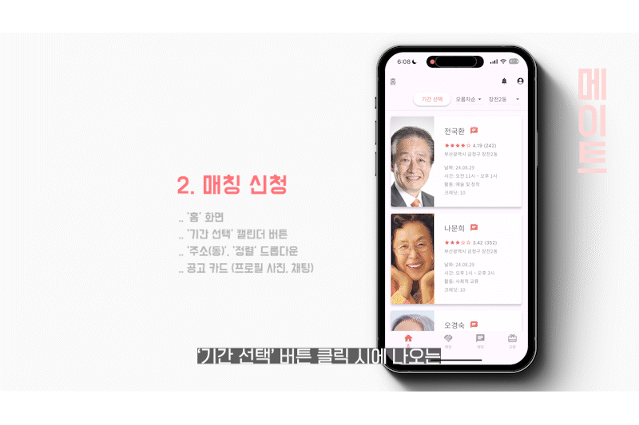

  - 기간선택 버튼 클릭시 캘린더가 나타나며 이를 통해 원하는 기간을 선택할 수 있습니다.


  - 정렬 드롭다운 버튼 클릭 시  오름차순과 내림차순을 설정할 수 있는 드롭다운 바가 나타나며 공고를 정렬 할 수 있습니다.


  - 주소 드롭다운 버튼 클릭 시 원하는 주소(동 단위)를 선택하여 검색 할 수 있습니다.

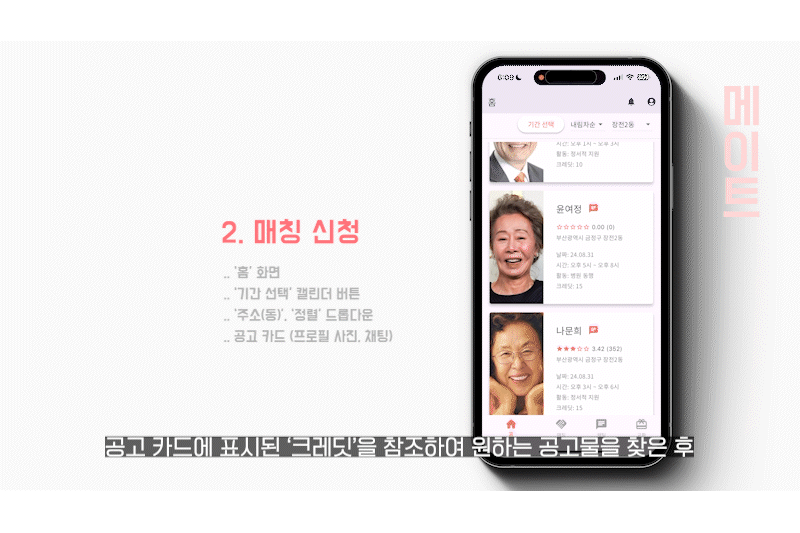

  - 목록에서 공고의 프로필 사진을 클릭하면 프로필 사진이 확대되어 보입니다.

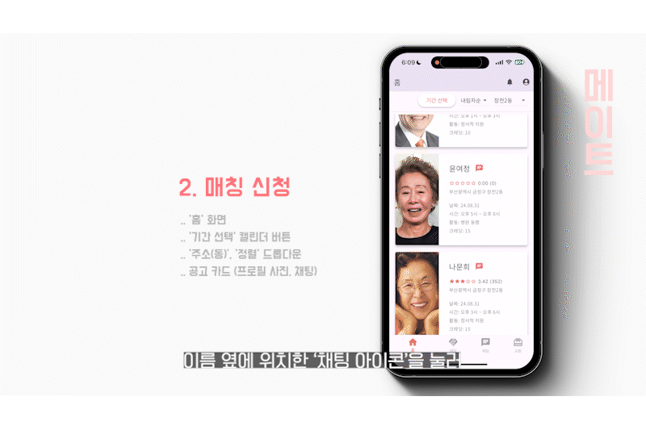

  - 목록에서 공고의 채팅아이콘을 클릭하면 즉시 해당 공고의 시니어와 채팅을 시작할 수 있습니다.


  - 목록에서 공고를 클릭하면 공고 상세정보 페이지로 이동합니다.

##### `라. 공고 상세정보`
  - 시니어의 정보를 포함한 공고의 상세정보를 보여줍니다.
  - 매칭신청 버튼

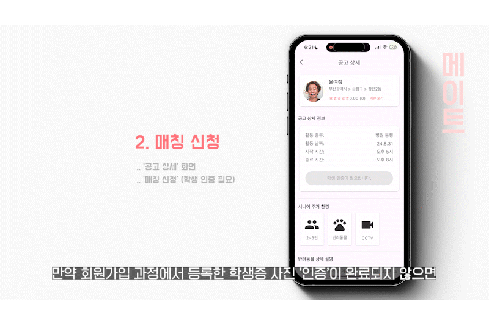

- 회원가입 과정에서 등록한 학생증사진 인증이 완료되지 않으면 매칭신청 버튼이 비활성화되며 '학생인증이 필요합니다.'라는 문구로 대체됩니다.

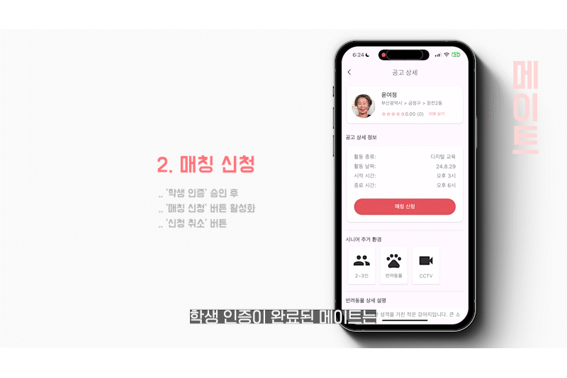
<br>

- 학생인증이 완료된 메이트의 경우 매칭신청 버튼이 정상적으로 표시되며 클릭시 매칭신청이 보내집니다.
- 매칭신청 이후 버튼이 매칭취소로 바뀌며 클릭시 보낸 매칭이 취소됩니다.
<br>

##### `마. 매칭페이지`
- 탭바


  - 매칭전 탭과 매칭후 탭으로 구분되어 있습니다.
- 매칭전 탭(시니어)

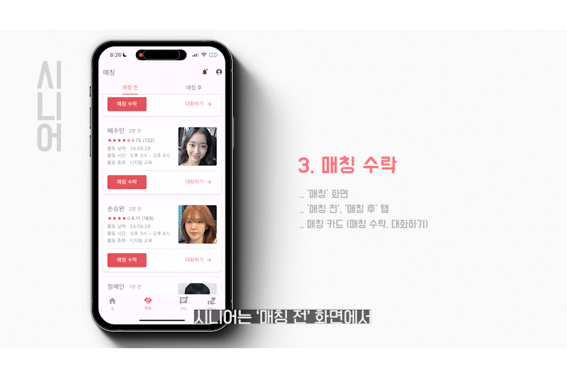

  - 메이트로부터 온 매칭 신청 목록을 확인 할 수 있습니다.

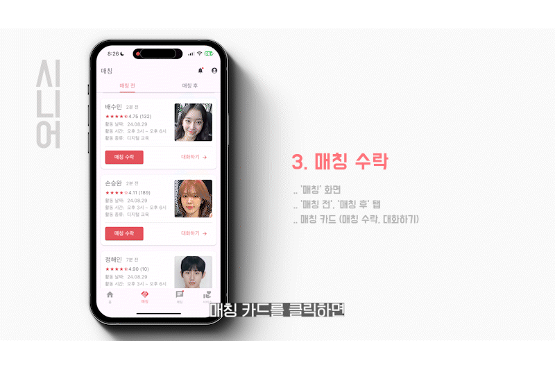

  - 매칭카드를 클릭 시 메이트의 상세정보를 확인 할 수 있습니다.
  - 메이트 상세정보
    - 메이트의 상세정보를 나타냅니다.


 - 리뷰보기 버튼을 클릭시 해당 메이트에 대한 시니어들의 평가를 확인 할 수 있습니다.


  - 매칭 수락 버튼
    - 매칭 수락버튼을 눌러 해당 매칭을 수락할 수 있습니다. 수락 할 시 매칭페이지의 매칭 후 탭으로 해당 매칭이 이동합니다.
    동시에 같은 공고에 신청했던 다른 메이트들의 신청이 취소됩니다.
    - 대화하기 버튼
      - 클릭 시 해당 메이트와 즉시 해당 메이트와 채팅을 시작할 수 있습니다.
- 매칭 전 탭(메이트)
  - 본인이 신청하였고, 시니어가 매칭 수락을 하지 않은 매칭들의 목록을 확인 할 수 있습니다.


<br>

 - 각 매칭카드는 활동정보와 신청취소 버튼으로 구성됩니다.


  - 매칭카드를 클릭 시 해당 시니어의 정보를 확인 할 수 있습니다.(상세주소는 표시되지 않음)
  - 신청취소 버튼을 클릭하면 신청한 매칭이 취소됩니다.

- 매칭 후 탭(시니어)
  - 성사된 매칭의 상세정보와 진행상황을 알 수 있습니다.
  - 활동이 종료되고 메이트가 종료보고서를 제출하였다면 리뷰쓰기 버튼이 활성화 됩니다.
  - 리뷰 작성 버튼을 클릭하면 활동한 메이트에 대한 평점과 리뷰를 남길 수 있습니다.
- 매칭 후 탭(메이트)
  - 본인이 신청하였고 시니어가 수락하여 성립된 매칭들의 목록을 확인 할 수 있습니다.
  - 각 매칭카드는 활동정보와 활동상태 버튼(초기값은 활동시작)으로 구성됩니다.


  - 매칭 카드를 클릭 시 해당 시니어의 정보를 확인 할 수 있습니다.(매칭이 성립되었으므로 상세주소가 표시됨)

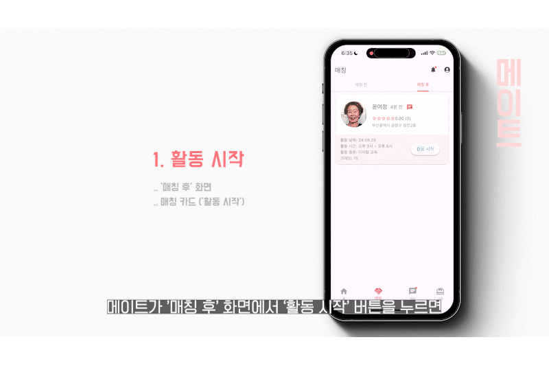

  - 활동시작 버튼을 누르면 해당 활동이 시작되며 시작 보고서 페이지로 이동합니다.
  - 시작보고서 페이지


<br>

 - 사진인증
    - 메이트와 시니어의 얼굴이 포함된 인증사진을 올리면 파이어베이스에서 벡터값을 불러와 얼굴 인증을 진행합니다.
    - 인증이 완료되면 인증 결과값을 알려줍니다.


<br>

  - 시작 보고서 글 작성
      - 시작보고서의 내용을 작성할 수 있습니다.


<br>

  - 시작보고서 제출하기 버튼
      - 얼굴인식 결과가 신원과 일치하고, 보고서 글 작성이 완료되었을 때 제출하기 버튼이 활성화되어 제출이 가능해집니다.
      - 제출이 완료되면 활동상태버튼이 활동시작->활동종료 로 변경됩니다.
    - 시니어의 비상연락망 정보
      - 활동중 위급상황을 대비해 시니어의 비상연락망을 표시합니다.
  - 활동 종료 버튼을 클릭 시 종료 보고서 페이지로 이동합니다.
  - 종료 보고서
    - 시작보고서 페이지와 구성이 동일하나 리뷰와 별점 작성란이 추가됩니다.
    - 리뷰/별점 작성란
      - 해당 매칭후 시니어에 대한 리뷰와 평점을 작성합니다.
      - 해당 작성란을 모두 기입해야 종료보고서 제출하기 버튼이 활성화 되어 제출이 가능해집니다.
    - 종료보고서 제출이 완료되면 시니어의 매칭 후 탭에서 시니어가 자신에 대한 리뷰과 평점을 작성할 수 있습니다.

<br>

---

<br>

##### `3.2.4. 교환 페이지`


- 메이트가 정상적으로 완료된 활동에대해 보상으로 받는 크래딧을 쓸 수 있는 페이지 입니다.


- 1365봉사시간 신청하기 버튼
  - 클릭하면 1365봉사시간 신청 페이지로 이동합니다.
  - 해당 페이지에서는 1365 로그인과 돌봄활동기록이 표시되며 신청하기 버튼을 통해 1365로 봉사시간 신청을 할 수 있습니다.


- 크래딧 교환
  - 적립한 크래딧으로 복지재단 후원금이나 기업에서 제공하는 상품을 신청 할 수 있습니다.

<br>

---

<br>

##### `3.2.5. 서비스 페이지`


- 시니어가 공공 복지 기관에서 제공하는 다양한 서비스를 신청 할 수 있는 페이지 입니다.
- 5개의 카테고리로 서비스들이 분류되었고, 각 카드를 선택하면 상세정보 페이지로 이동합니다.
- 상세정보페이지에서는 해당 서비스의 상세 내용과 신청링크를 터치하여 해당 서비스웹페이지로 이동할 수 있습니다.

<br>

---

<br>

##### `3.2.6. 채팅페이지`


- 채팅방의 목록을 보여줍니다. 각 채팅방을 클릭함으로써 해당 채팅방으로 이동할 수 있습니다.
- 채팅방에 진입하여 활동관련질문과 요구사항등을 전달 할 수 있습니다.

<br>

---

<br>

##### `3.2.7. 알림`


- 새로운 채팅 메시지가 오거나 매칭상태가 변경되면 알림아이콘에 빨간 점이 표시됩니다.
- 알림 아이콘을 클릭하여 알림 목록으로 이동할 수 있습니다.
- 알림 목록에서 각 알림메시지를 클릭하면 해당 채팅방 또는 해당 매칭화면으로 이동할 수 있습니다.

<br>

---

<br>

##### `3.2.8. 활동기록`
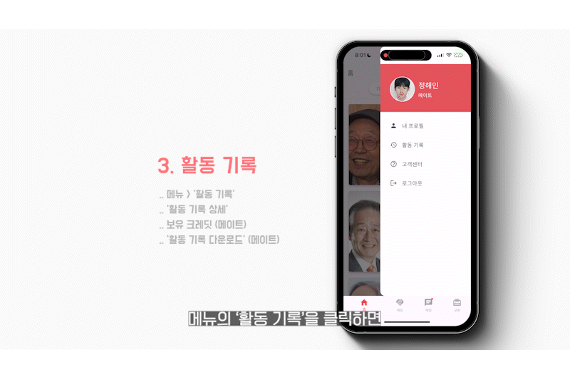

- 본인이 참여했던 모든 활동기록 목록을 볼 수 있습니다.


- 각 활동기록을 클릭하면 해당 활동정보와 함께 작성했던 보고서를 확인할 수 있습니다.


- 메이트의 경우 상단에 보유중인 크래딧이 표시되며, 활동기록 다운로드를 통해 엑셀파일 형식으로 다운로드 할 수 있습니다.

<br>

---

<br>

##### `3.2.9. 고객센터`


- 자주묻는 질문들과 문의하기 버튼이 표시됩니다.
- 문의하기 버튼을 누르면 문의하기 페이지로 이동하며 문의글을 직접 작성할 수 있습니다.
- 문의글을 작성후 문의 접수 버튼을 누르면 따시게 이메일로 이용자 식별코드와 함께 문의 내용이 전송됩니다.
<br/>


#### 3.3. 기능명세서
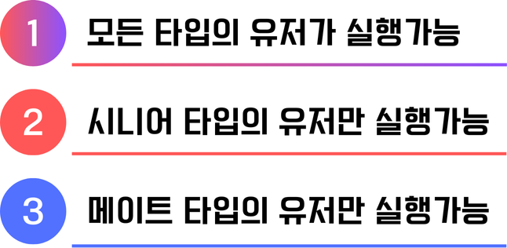

1. 회원가입

    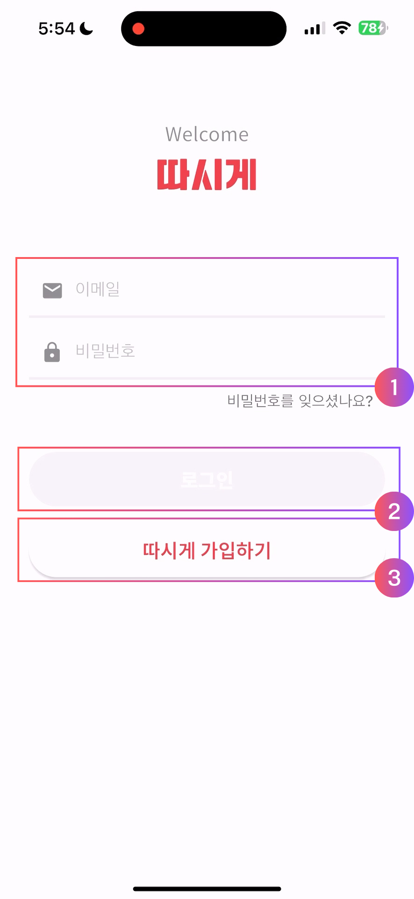 
    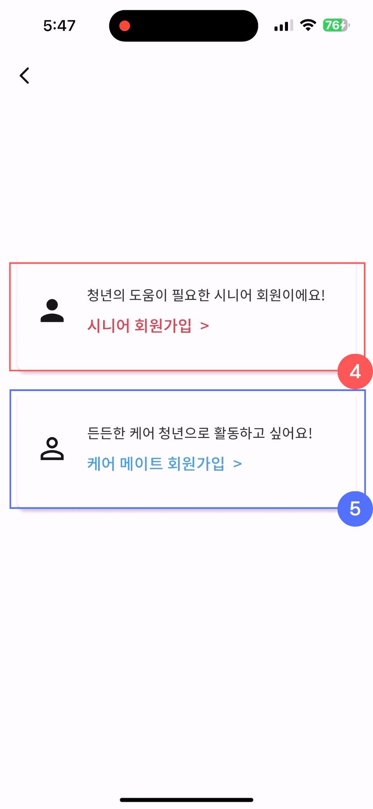 
    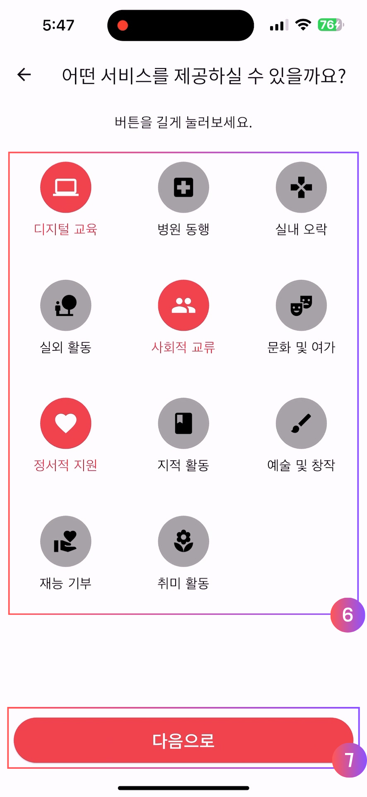

    |라벨|이름|상세|
    |:---:|:----------------------------:|:---|
    | 1  | 로그인 정보입력란             | - 로그인에 필요한 이메일과 비밀번호를 입력
    | 2  | 로그인 버튼 | - 정보입력칸에 이메일과 비밀번호가 입력되어 있으면 버튼 활성화 <br> - 버튼 클릭시 이메일과 비밀번호가 맞으면 로그인  |
    | 3  | 회원가입 버튼                 | - 클릭시 회원가입 페이지로 이동 |
    | 4  | 시니어 회원가입            | - 돌봄을 받는 시니어로 회원가입 |
    | 5  | 메이트 회원가입                       | - 돌봄을 하는 대학생인 케어메이트로 회원가입 |
    | 6  | 제공 서비스 선택                  | - 메이트 : 제공하는 서비스 선택 <br> - 시니어 : 제공받는 서비스 선택 |
    | 7  | 다음 버튼                     | - 회원가입에서 다음단계로 넘어감  <br> - 필수 입력정보가 하나라도 비어있으면 비활성화됨 | 

    <br>
    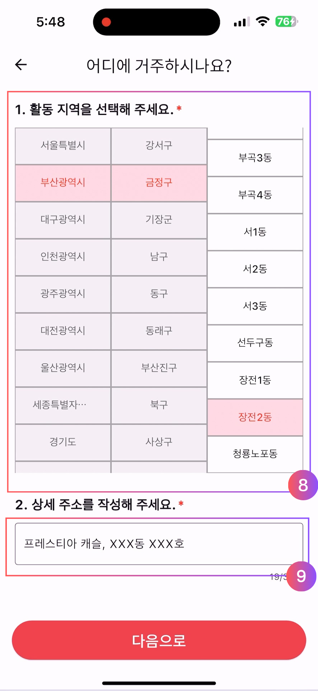
    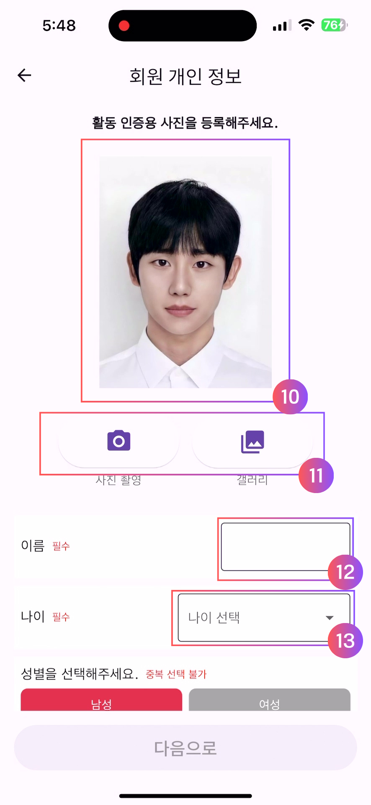 
    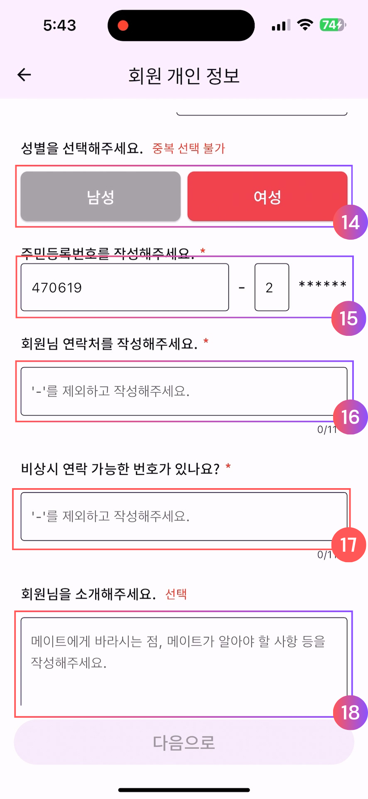 

    |라벨|이름|상세|
    |:---:|:----------------------------:|:---|
    | 8  | 활동지역 선택             | - 서비스를 제공/받는 지역 선택 <br> - 동 단위까지 선택
    | 9  | 상세주소 작성 | - 상세 주소 입력  |
    | 10  | 사진 표시                 | - 업로드한 사진이 표시됨 |
    | 11  | 사진 촬영, 갤러리 버튼            | - 클릭하여 직접 사진 촬영을 하거나 갤러리에서 얼굴사진을 업로드 <br> - 업로드된 사진은 구글MLKIT를 통해 얼굴을 인식하여 저장됨 |
    | 12  | 메이트 회원가입                       | - 돌봄을 하는 대학생인 케어메이트로 회원가입 |
    | 13  | 제공 서비스 선택                  | - 메이트 : 제공하는 서비스 선택 <br> - 시니어 : 제공받는 서비스 선택 |
    | 14  | 다음 버튼                     | - 회원가입에서 다음단계로 넘어감  <br> - 필수 입력정보가 하나라도 비어있으면 비활성화됨 |
    | 15  | 주민등록번호 입력란             | - 본인인증을 위한 주민등록번호 입력
    | 16  | 연락처 입력란 | - 연락가능한 본인의 연락처 기입 |
    | 17  | 비상연락망 입력란                 | - 자녀나 간병인 등 비상시 연락이 필요한 사람의 연락처 입력 |
    | 18  | 특이사항 입력란           | - 추가로 상대방이 알아야 하는 특이사항을 입력 |
    

    <br>
    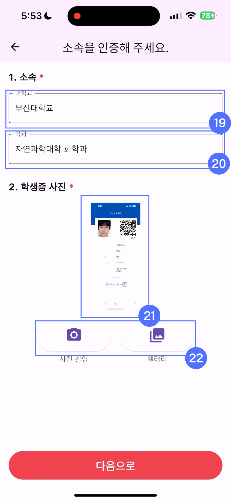 
    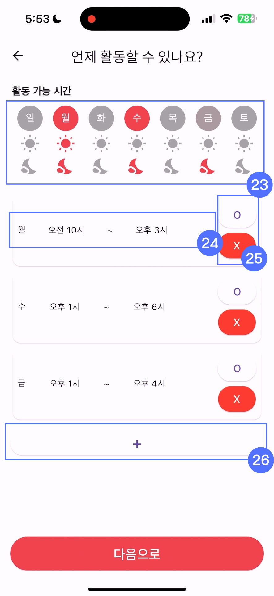 
    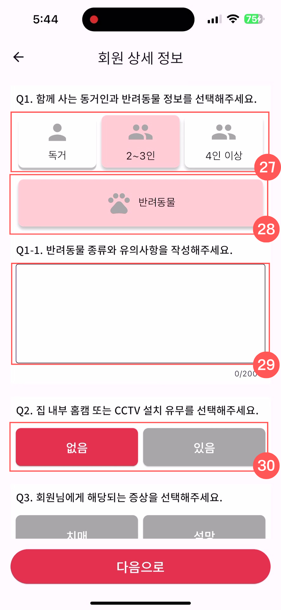 

    |라벨|이름|상세|
    |:---:|:----------------------------:|:---|
    | 19  | 소속 대학교 입력란             | - 현재 소속된 대학교 입력 <br> - 등록된 대학교가 아니면 회원가입이 불가함
    | 20  | 학과 입력란 | - 상세 주소 입력  |
    | 21  | 학생증 표시                 | - 업로드한 학생증이 표시됨 |
    | 22  | 사진 촬영, 갤러리 버튼            | - 클릭하여 직접 사진 촬영을 하거나 갤러리에서 학생증사진을 업로드 <br> - 학생증을 업로드 하지 않으면 회원가입은 가능하나 학생 인증이 되지 않아 돌봄활동이 불가능 |
    | 23  | 요일, 시간대 표시                       | - 각 요일을 터치하여 요일을 선택 <br> - 각 요일별로 등록된 시간에 따라 오전 오후 별로 가능한 시간대가 표시됨 |
    | 24  | 가능 시간대 선택                  | - 자신의 학교 시간표를 기준으로 공강등 돌봄 활동이 가능한 시간대를 선택 <br> - 이후에 매칭을 본인이 선택하고, 채팅기능도 이용 가능하기 때문에 절대적인 활동가능 시간을 의미하지는 않는다. |
    | 26  | 가능시간대 추가 버튼             | - 클릭시 가능시간대를 입력할 수 있는 란이 추가된다. |
    | 27  | 동거인 수 버튼             | - 현재 속한 동거인 혹은 가족의 수를 선택
    | 28  | 반려동물 버튼 | - 반려동물이 존재시 클릭  |
    | 29  | 반려동물 상세정보 입력란                | - 반려동물 버튼을 클릭시 나타남 <br> - 반려동물의 상세정보와 특이사항을 입력 |
    | 30  | cctv/홈캠 존재 여부 버튼            | - 홈캠이나 집 내부에 cctv가 존재시 선택 |
    

    <br>
    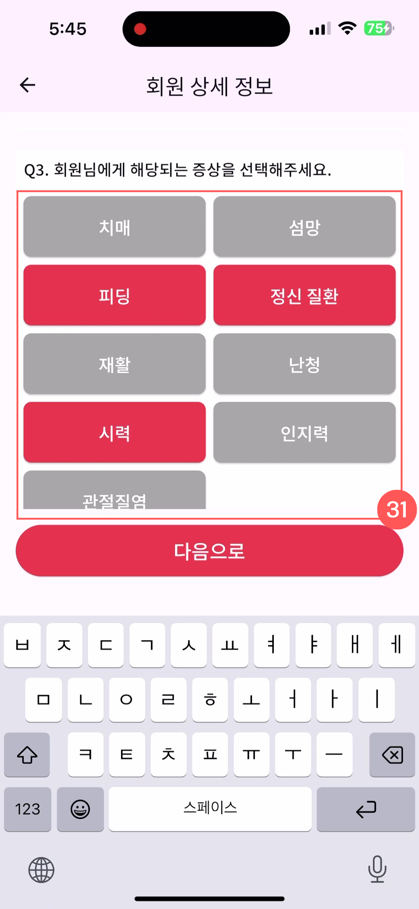 
    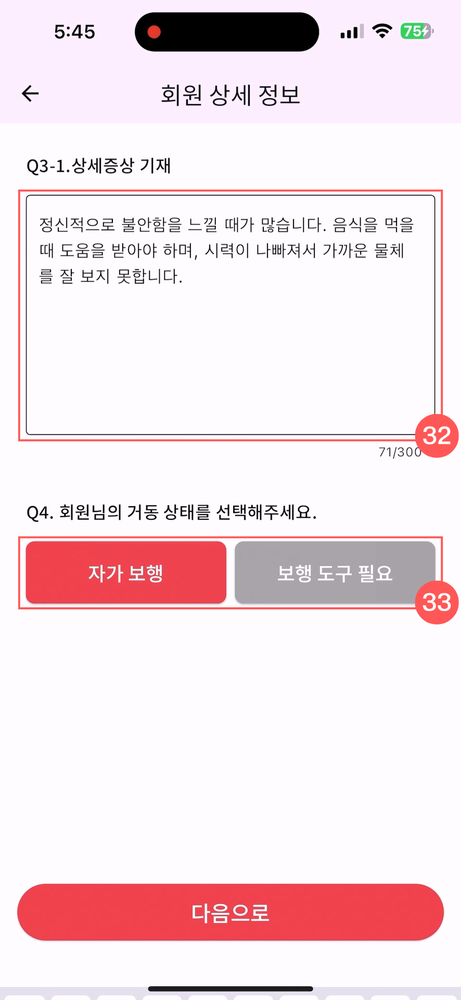 
    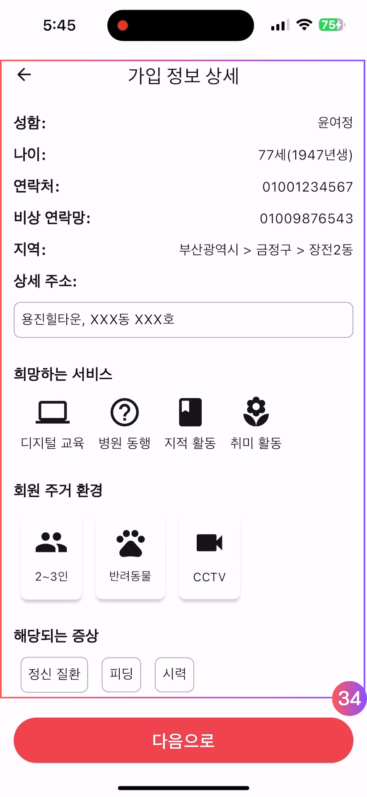 

    |라벨|이름|상세|
    |:---:|:----------------------------:|:---|
    | 31  | 질병 선택란             | - 가지고 있는 질병 선택(다중선택 가능)
    | 32  | 상세증상 기재란 | - 질병이 있을 시 상세한 증상을 쓰는 란  |
    | 33  | 보행도구 필요 여부                 | - 보행시 필요한 보행도구가 있는지 여부를 선택 |
    | 34  | 입력정보 재검토            | - 자신이 입력한 내용 중 틀린 내용은 없는지 재검토를 위해 입력한 정보 표시 |

    <br>
    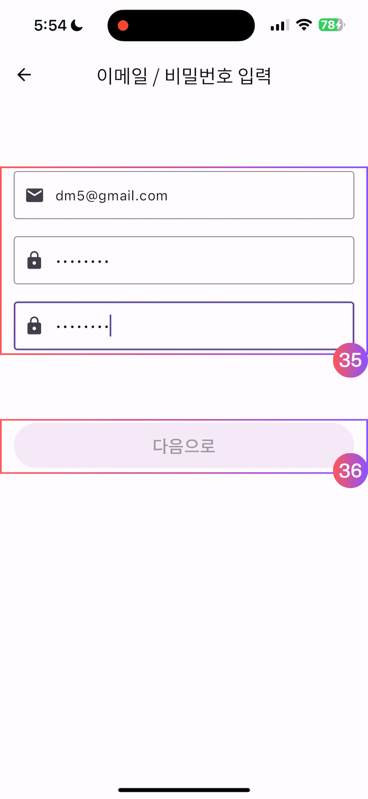 

    |라벨|이름|상세|
    |:---:|:----------------------------:|:---|
    | 35  | 회원가입 정보 입력란             | - 로그인에 사용되는 이메일과 비밀번호, 비밀번호 확인 입력란
    | 36  | 회원가입 완료 버튼 | - 클릭시 회원가입 완료|

    <br>

2. 로그인

    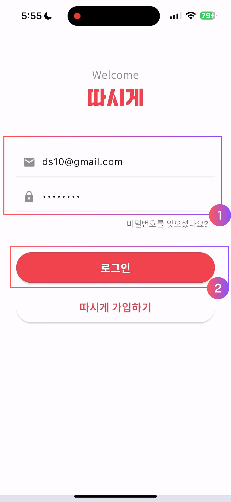 
    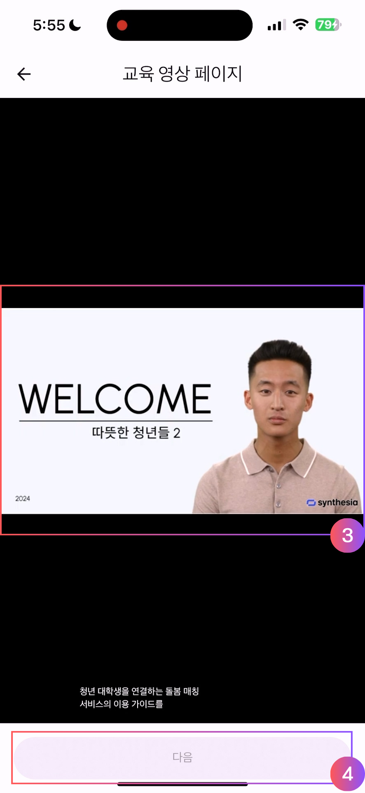 


    |라벨|이름|상세|
    |:---:|:----------------------------:|:---|
    | 1  | 로그인 정보 입력란              | - 로그인을 위한 알맞은 이메일과 비밀번호를 입력 |
    | 2  | 로그인 버튼| - 이메일과 비밀번호를 입력시 활성화 <br> - 클릭시 입력한 정보가 등록된 유저정보와 일치한다면 로그인 |
    | 3  | 교육 영상                 | - 첫 로그인시 교육영상 필수 시청 |
    | 4  | 다음 버튼            | - - 끝까지 시청하기 전까진 비활성화 <br> - 활성화 후 터치시 홈페이지로 이동|

3. 홈페이지

    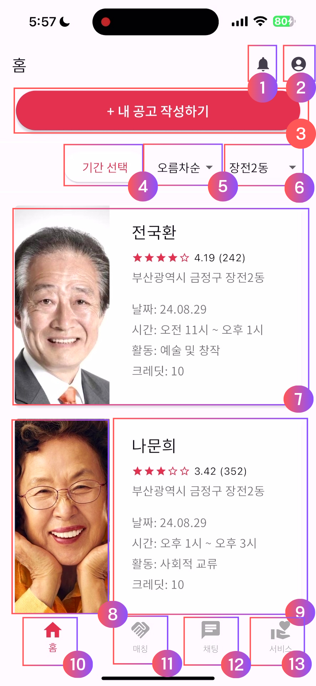 
    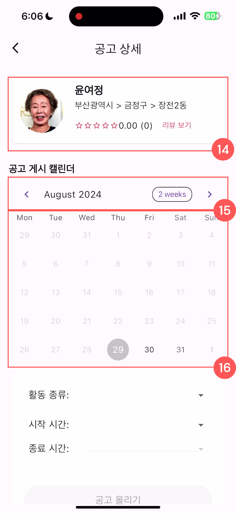 
     

    |라벨|이름|상세|
    |:---:|:----------------------------:|:---|
    | 1  | 알림 버튼             | - 클릭시 알림 페이지로 이동
    | 2  | 메뉴 버튼 | - 클릭시 사이드바로 메뉴탭 표시  |
    | 3  | 공고 작성 버튼                 | - 클릭시 공고 작성페이지로 이동 |
    | 4  |  기간선택 버튼         | - 클릭시 기간선택페이지로 이동 <br> - 기간선택을 완료하면 공고목록에 선택된 기간안의 공고만을 표시함 |
    | 5  | 정렬 버튼                 | - 클릭시 공고 목록 정렬됨 <br> - 오름차순 혹은 내림차순으로 정렬가능 |
    | 6  |  지역 선택 버튼              | - 클릭시 드롭다운으로 지역이 표시됨 <br> - 원하는 지역을 클릭시 해당지역의 공고만 공고목록에 표시함 |
    | 7  | 공고카드                 | - 해당공고를 올린 시니어의 프로필사진과 공고의 정보들을 표시 |
    | 8  | 공고카드 프로필 부분                | - 클릭시 해당프로필이 확대됨 |
    | 9  | 공고카드 내용 부분            | - 클릭시 해당 공고의 상세정보 페이지로 이동|
    | 10  | 홈페이지 네비게이션 버튼            | - 클릭시 홈페이지로 이동|
    | 11  | 매칭페이지 네비게이션 버튼            | - 클릭시 매칭페이지로 이동|
    | 12  | 채팅 네비게이션 버튼            | - 클릭시 채팅 페이지로 이동|
    | 13  | 서비스 네비게이션 버튼         | - 클릭시 서비스 페이지로 이동|
    | 14  | 프로필 표시            | - 공고를 올릴 시 상세정보에 나타날  프로필이 간략히 표시됨|
    | 15  | 캘린더 월단위 이동버튼            | - 월단위로 캘린더를 이동시킨다.|
    | 16  | 캘린더            | - 원하는 날짜를 터치하여 공고를 개시할 수 있다.|
    | 17  | 현재날짜 표시            | - 현재날짜는 캘린더에 회색 동그라미로 표시된다.|
    | 18  | 공고표시등            | - 해당날짜에 등록된 공고가 있을 때 해당날짜에 빨간 점으로 표시된다.|
    | 19  | 선택 날짜 표시            | -  현재 선택된 날짜 표시 <br> - 날짜가 빨간색으로 선택이 되어야 공고를 개시할 수 있다.|
    | 20  | 공고 정보 입력란           | - 올릴 공고의 정보를 입력한다. <br> - 활동 종류, 시작 시간, 종료 시간 |
    | 21  | 공고 올리기 버튼            | - 해당날짜에 등록된 공고가 있을 때 해당날짜에 빨간 점으로 표시된다.|

    <br>
    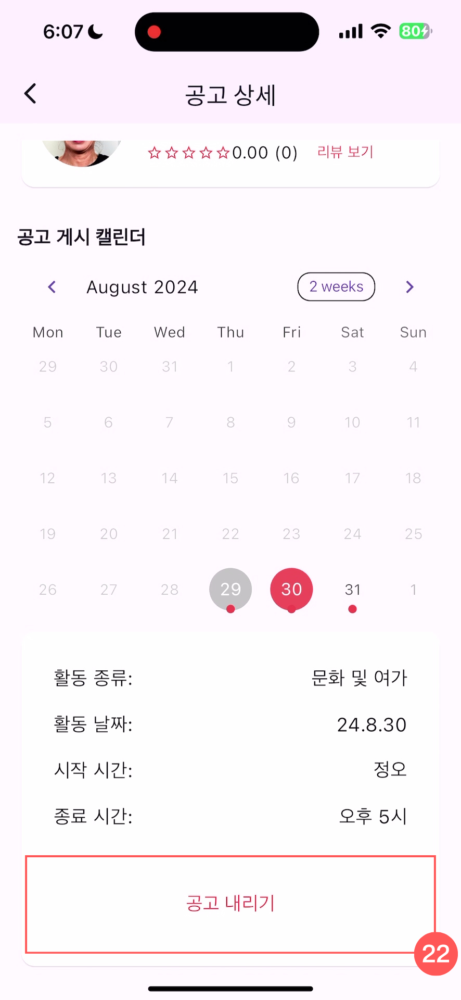 
    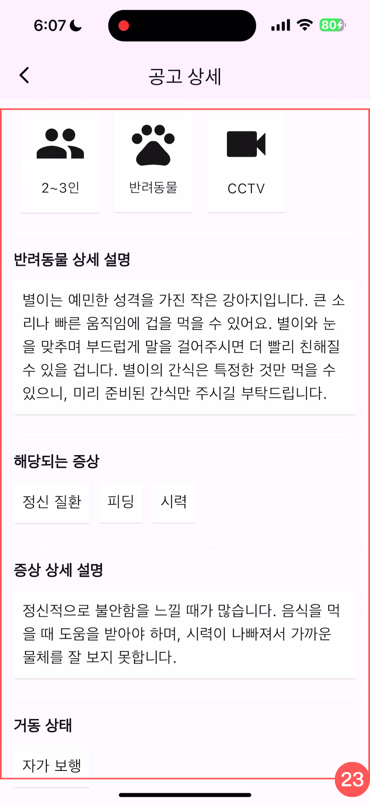 
    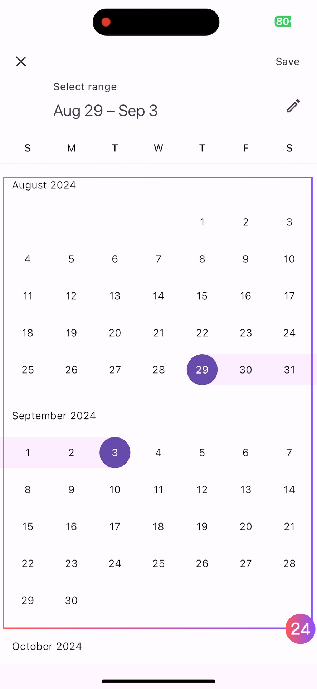 

    |라벨|이름|상세|
    |:---:|:----------------------------:|:---|
    | 22  | 공고 내리기 버튼             | - 클릭시 해당 공고가 내려짐 <br> - 선택된 날짜에 공고가 존재할때 공고 올리기 버튼이 공고 내리기 버튼으로 대채됨
    | 23  | 공고 상세 정보 | - 해당 공고에 표시될 상세정보가 표시된다.  |
    | 24  | 기간선택 캘린더                 | - 원하는 기간을 선택하여 공고 목록을 필터링하여 표시함 |

    <br>
    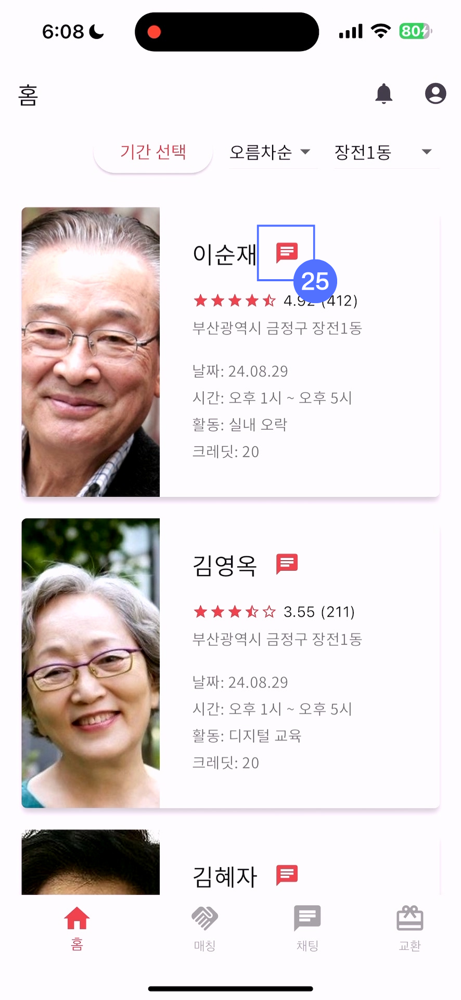 
    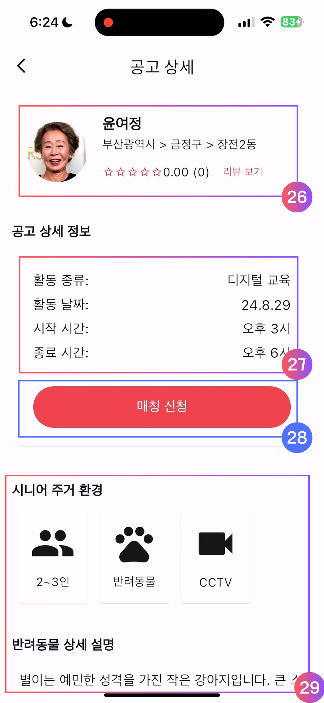 

    |라벨|이름|상세|
    |:---:|:----------------------------:|:---|
    | 25  | 채팅버튼             | - 클릭시 해당 공고를 올린 시니어와 채팅방을 생성하여 채팅을 보낼 수 있다. 
    | 26  | 프로필 요약 | - 해당 공고를 올린 시니어의 간략한 프로필 정보이다.  |
    | 27  | 공고 상세 정보                 | - 해당 공고의 시간과 활동종류등 상세 정보를 표시함 |
    | 28  | 매칭 신청 버튼             | - 클릭시 해당 공고를 올린 시니어에게 매칭신청을 할 수 있다. <br> - 매칭을 신청하면 시니어의 매칭페이지의 매칭전 탭에 신청이 전송된다.
    | 29  | 매칭상세정보 | - 해당 공고를 올린 시니어의 상세 정보이다. <br> - 매칭이 성사되기 전까진 상대방에게 상세주소가 표시되지 않는다. |

4. 매칭페이지

    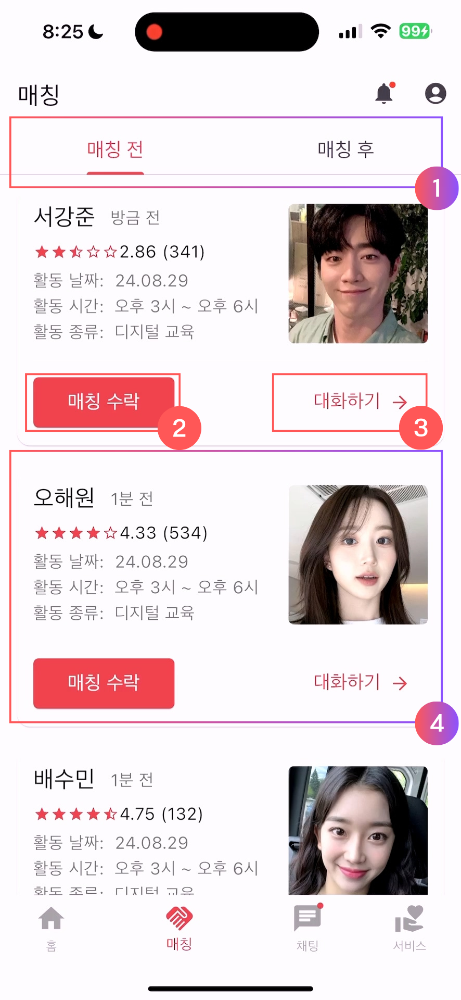
    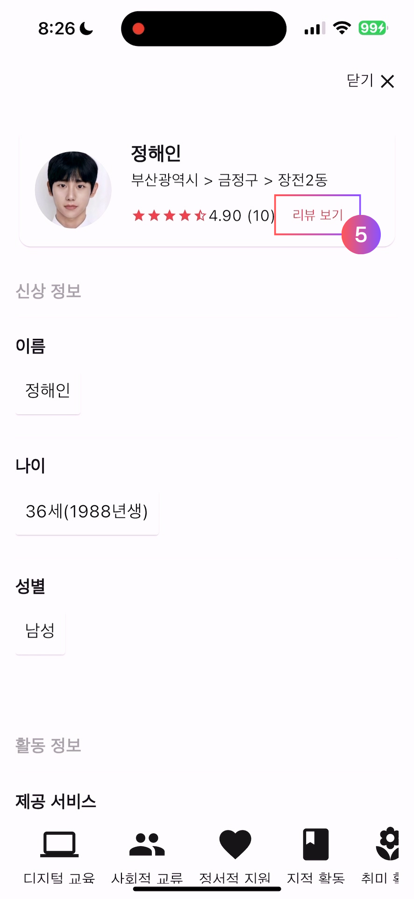
    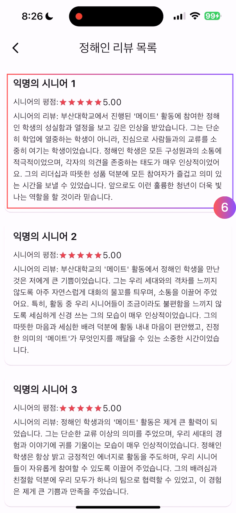

    |라벨|이름|상세|
    |:---:|:----------------------------:|:---|
    | 1  | 매칭 전/후 탭바            | - 각 탭바를 클릭하면 매칭 전/후 탭을 이동할 수 있다. 
    | 2  | 매칭 수락 버튼 | - 클릭시 해당 공고를 신청한 메이트와 매칭이 성사된다.  |
    | 3  | 대화하기 버튼                 | - 클릭시 해당 메이트와 채팅방이 생성되고 채팅방으로 이동한다. |
    | 4  | 매칭 신청 카드             | - 신청을 한 메이트의 정보를 담은 카드이다.
    | 5  | 리뷰보기 버튼 | - 클릭시 해당 유저가 받은 리뷰와 별점들을 모아볼 수 있는 페이지로 이동한다. |
    | 6  | 리뷰 카드 | - 각 카드는 해당 유저가 받은 리뷰와 별점이다. <br> - 모든 리뷰는 익명으로 표시된다. |

    <br>
    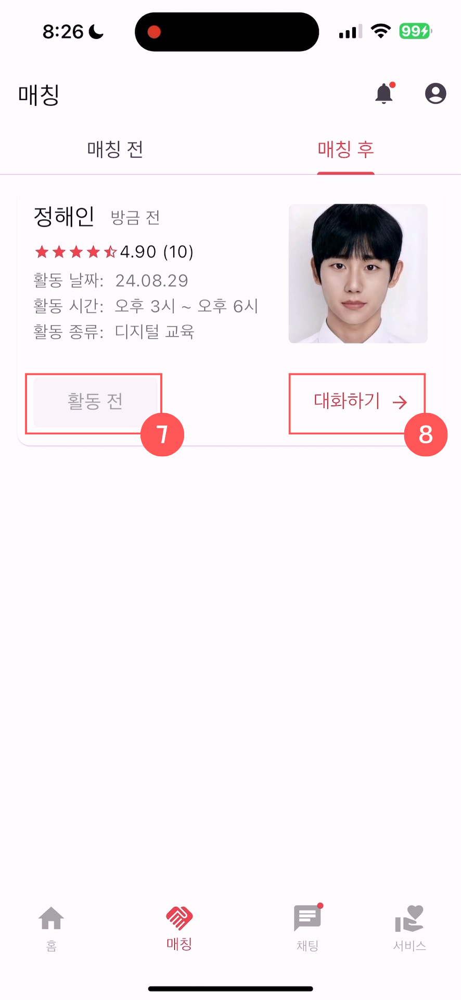
    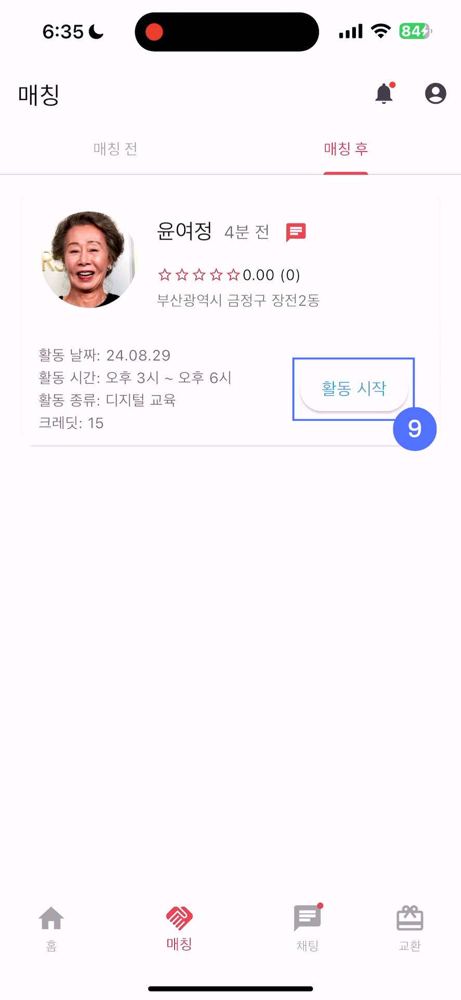
    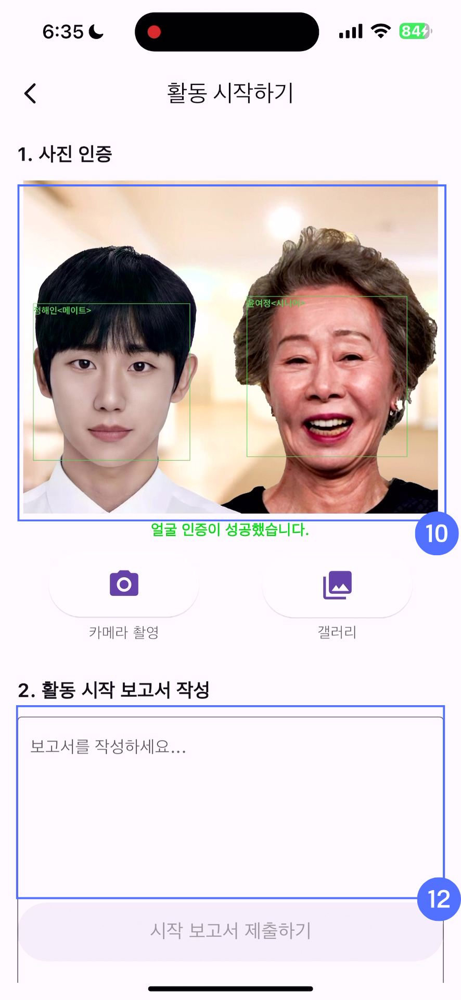

    |라벨|이름|상세|
    |:---:|:----------------------------:|:---|
    | 7  | 활동 상태 표시            | - 매칭의 현재 진행상태를 볼 수 있다. <br> - 매칭의 진행상태는 메이트가 작성하는 보고서의 작성 상태에 따라 달라진다.
    | 8  | 대화하기 버튼 | - 클릭시 해당 메이트와 채팅방이 생성되고 채팅방으로 이동한다 |
    | 9  | 활동 시작 버튼                 | - 클릭시 활동 시작 보고서 페이지로 이동한다. <br> - 활동 시작 보고서는 활동하는 두명 모두의 얼굴이 담긴 사진을 필요로 하므로 반드시 활동 시작후 작성하여야 한다. |
    | 10  | 시작보고서 사진 표시  | - 시작보고서에 필수인 시니어와 메이트가 같이 찍은 사진이다. <br> - 해당 사진을 구글 MLKIT으로 분석하여 해당 사진에 시니어와 메이트의 얼굴이 다 포함하는지 분석후 결과를 알려준다.
    | 12  | 활동 시작 보고서 작성란 | - 활동 시작 보고서를 작성하는 란이다. |

    <br>
    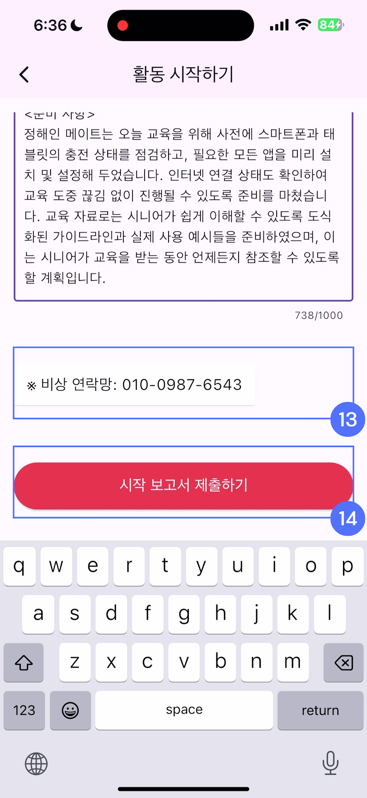
    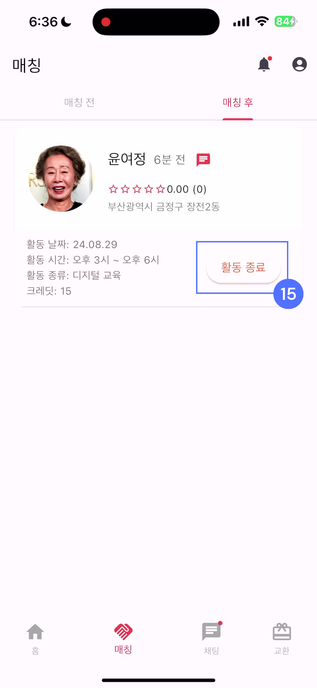
    

    |라벨|이름|상세|
    |:---:|:----------------------------:|:---|
    | 13  | 비상연락망 표시            | - 활동중 비상상황에 대비하여 연락망이 표시된다.
    | 14  | 시작보고서 제출하기 버튼 | - 보고서를 모두 작성 후 클릭시 매칭상태가 활동중으로 바뀌고 활동시작 버튼이 활동 종료버튼으로 바뀐다. |
    | 15  | 활동 종료 버튼                 | - 클릭시 활동 종료 보고서 페이지로 이동한다. |
    | 16  | 별점 버튼  | - 같이 활동을 진행한 시니어에 대한 평점을 매길 수 있다.
    | 17  | 리뷰 작성란 | - 같이 활동을 진행한 시니어에 대한 리뷰를 작성할 수 있다. |

    <br>
    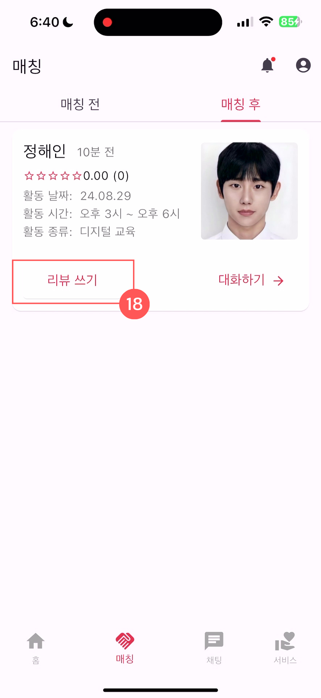
    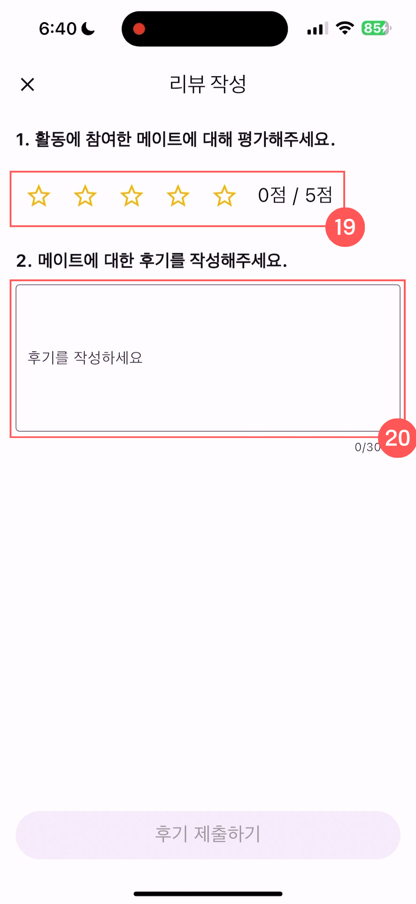

    |라벨|이름|상세|
    |:---:|:----------------------------:|:---|
    | 18  | 리뷰 쓰기 버튼            | - 메이트가 모든 보고서를 제출하여 활동이 종료 된 후 리뷰쓰기 버튼이 활성화된다.
    | 19  | 별점 버튼  | - 같이 활동을 진행한 메이트에 대한 평점을 매길 수 있다.
    | 20  | 리뷰 작성란 | - 같이 활동을 진행한 메이트에 대한 리뷰를 작성할 수 있다. |
<br>

5. 교환페이지

    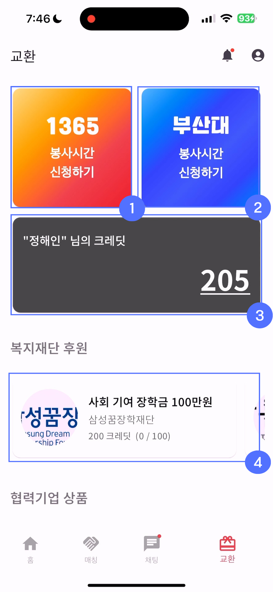
    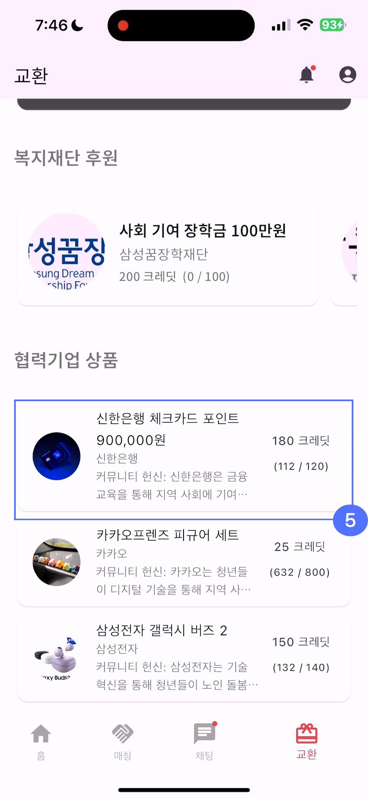
    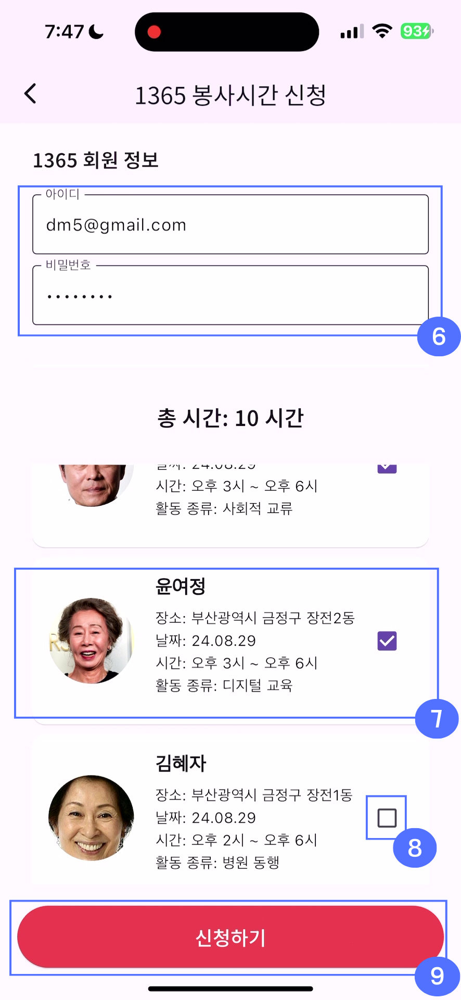   

    |라벨|이름|상세|
    |:---:|:----------------------------:|:---|
    | 1  | 1365 봉사활동 신청하기 버튼            | - 클릭시 1365 봉사 신청  페이지로 이동한다.
    | 2  | 부산대 봉사활동 신청하기 버튼  | - 클릭시 부산대학교 봉사 신청  페이지로 이동한다. <br> - 다른 대학교에 소속되어 있을 경우 이에 맞게 버튼 이름이 바뀐다.
    | 3  | 보유 크래딧 표시 | - 정상적으로 마친 활동에 대한 보상인 크래딧의 보유량을 표시함 |
    | 4  | 복지재단후원             | - 크래딧을 복지재단 후원으로 받은 장학금과 교환할 수 있다.
    | 5  | 협력기업상품  | - 크래딧을 협력기업의 상품으로 교환 할 수 있다.
    | 6  | 1365 로그인란 | - 1365에 로그인하여 1365에 봉사활동을 업로드 할 수 있다. |
    | 7  | 봉사 신청 가능한 활동 | - 정상적으로 완료한 활동에 대해 활동시간이 인정되며 이를 1365에 봉사시간으로 보낼 수 있다. |
    | 8  | 체크란 | - 클릭하면 해당활동이 체크가 되어 1365로 보낼 수 있다. |
    | 9  | 신청하기 | - 체크된 활동들의 데이터를 1365로 전송한다. |

    <br>
    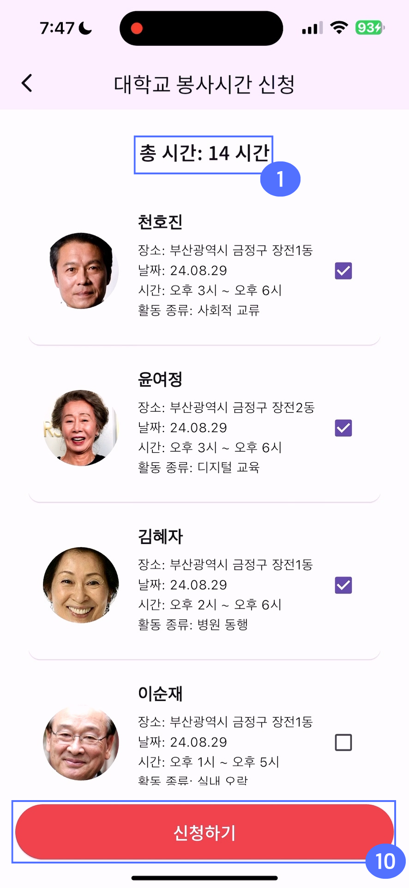
    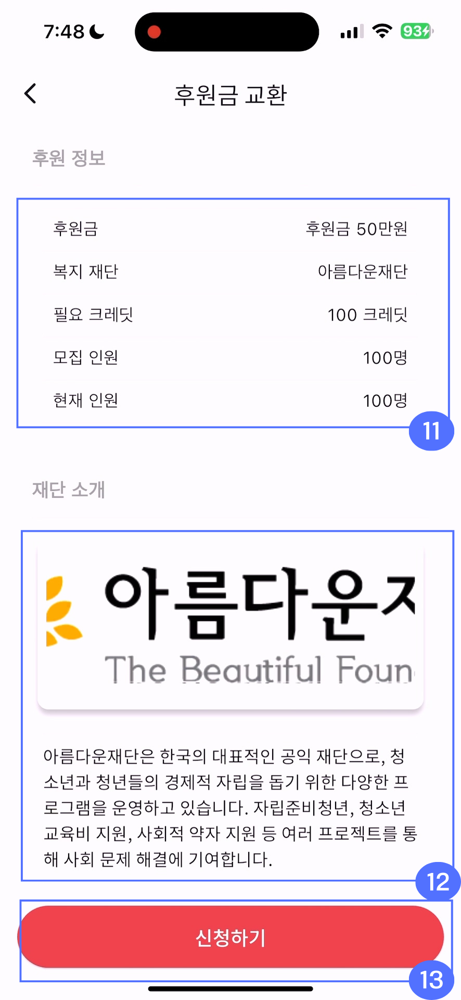
    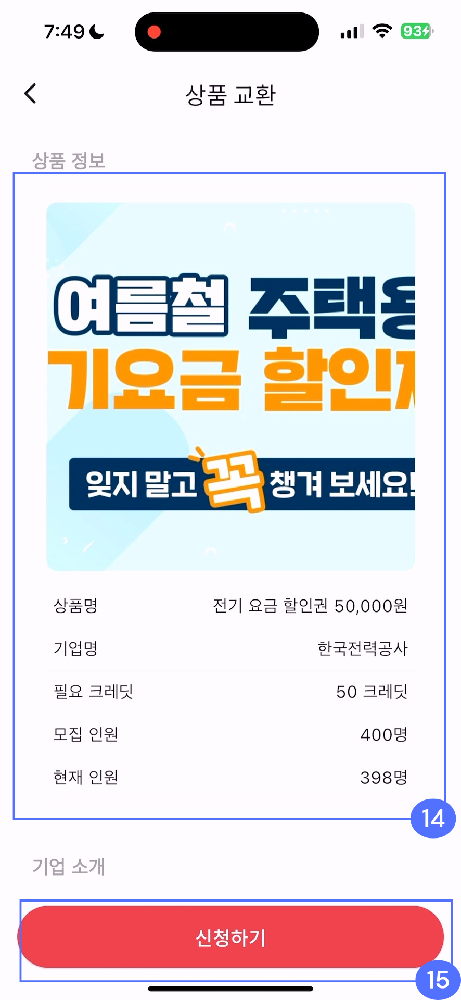

    |라벨|이름|상세|
    |:---:|:----------------------------:|:---|
    | 10  |총 시간 표시           | - 체크표시로 선택한 봉사활동들의 총 시간이다.
    | 10  | 부산대 봉사시간 신청하기 버튼  | - 클릭시 체크한 활동들과 시간이 부산대학교에 전송된다. <br> - 다른 대학교에 소속되어 있을 경우 이에 맞게 버튼 이름이 바뀐다.
    | 11  | 후원정보를 표시. | - 크래딧으로 교환 가능한 후원금에 대한 후원정보를 표시한다. |
    | 12  | 재단 소개             | - 후원금을 제공하는 재단에 대한 소개글이다.
    | 13  | 후원금 신청하기 버튼  | - 클릭시 크래딧이 교환가능할 정도로 충분하다면 교환에 성공하고 후원금과 크래딧을 교환한다.
    | 14  | 상품정보 | - 크래딧으로 교환가능한 기업의 상품에 대한 정보이다. |
    | 15  | 상품 신청하기 버튼 | - 클릭시 크래딧이 교환가능할 정도로 충분하다면 교환에 성공하고 상품과 크래딧을 교환한다. |

    <br>
    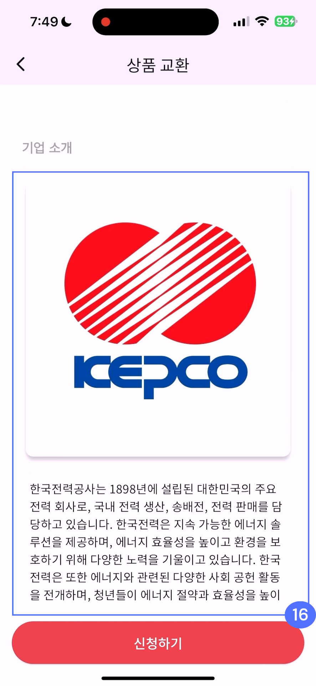
    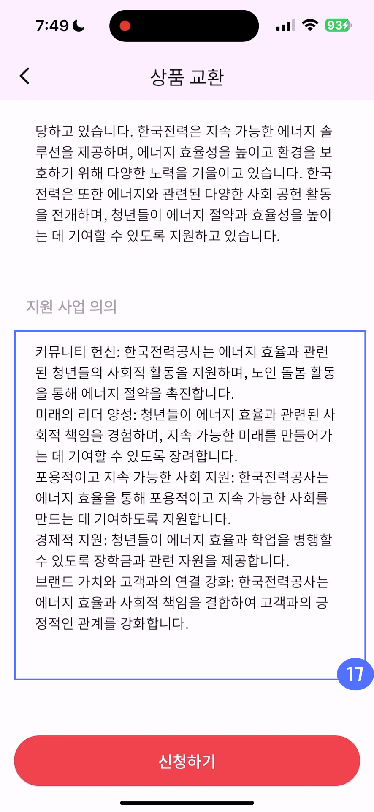

    |라벨|이름|상세|
    |:---:|:----------------------------:|:---|
    | 16  |기업소개           | - 크래딧으로 교환 가능한 상품을 제공하는 기업의 소개글이다.
    | 17  | 지원사업의의  | - 상품을 지원하는 의의를 설명하는 글이다.|

    <br>

6. 서비스 페이지

    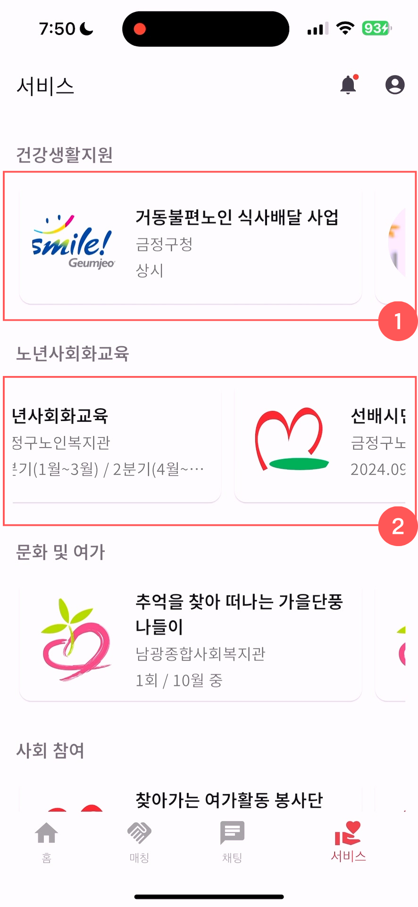
    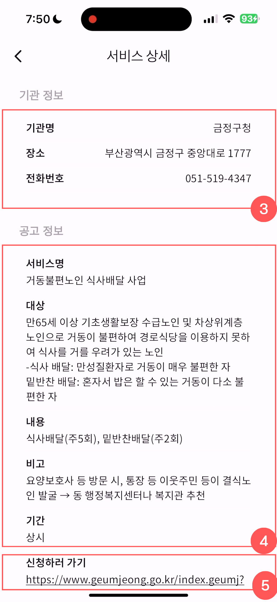

    |라벨|이름|상세|
    |:---:|:----------------------------:|:---|
    | 1  |서비스 카드           | - 시니어에게 제공하는 서비스를 간략히 보여주는 카드이다 <br> - 서비스 카드들에는 5가지 카테고리가 있다.
    | 2  | 스크롤바  | - 좌우 스크롤 시 해당 카테고리의 다른 서비스들을 볼 수 있다.
    | 3  | 서비스 기관정보 | - 서비스를 제공하는 기업의 정보이다. |
    | 4  | 서비스 상세내용             | - 해당 서비스의 상세내용이다.
    | 5  | 신청하러가기 링크  | - 클릭시 해당 서비스를 제공하는 웹사이트로 이동한다.

<br>

7. 채팅페이지

    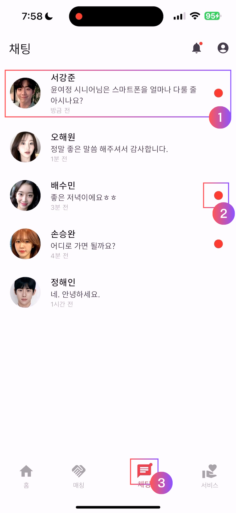
    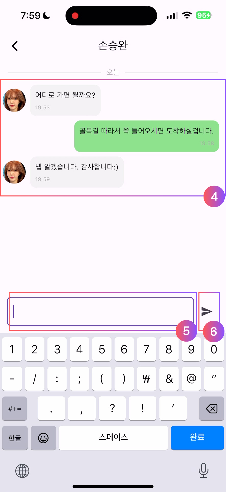

    |라벨|이름|상세|
    |:---:|:----------------------------:|:---|
    | 1  |채팅방 정보           | - 해당 채팅방의 간략한 정보이다. <br> - 채팅방은 홈페이지나 매칭페이지에서의 채팅하기 버튼을 클릭하여 생성 할 수 있다.
    | 2  | 알림표시(채팅방)  | - 해당 채팅방의 채팅을 아직 읽지 않았다면 빨간점으로 표시된다.
    | 3  | 알림표시(네비게이션 바) 기관정보 | - 읽지않은 채팅이 있을 때 채팅네비게이션 바에 빨간점으로 표시된다. |
    | 4  | 채팅내용             | - 당사자와 채팅한 내용이다.
    | 5  | 채팅바  | - 원하는 채팅을 적을 수 있다.
    | 6  | 보내기 버튼            | - 클릭시 채팅바에 입력한 채팅을 상대방에게 전송한다.

<br>

8. 알림페이지

    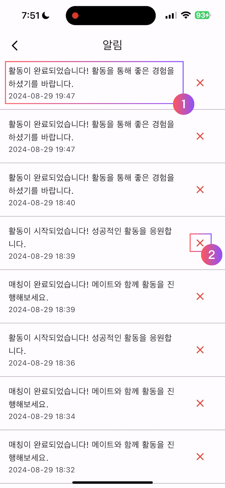

    |라벨|이름|상세|
    |:---:|:----------------------------:|:---|
    | 1  |알림정보           | - 해당 알림의 간략한 정보이다. <br> - 클릭시 해당 페이지나 채팅방으로 이동한다.
    | 2  | 알림 지우기 버튼  | - 해당 알림을 삭제한다.

<br>

9. 메뉴바

    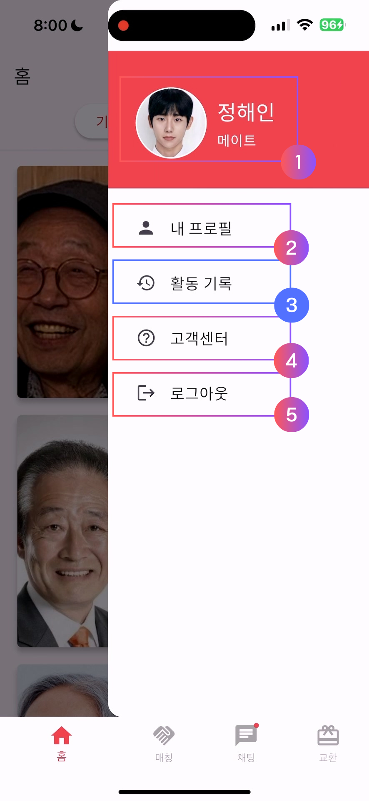
    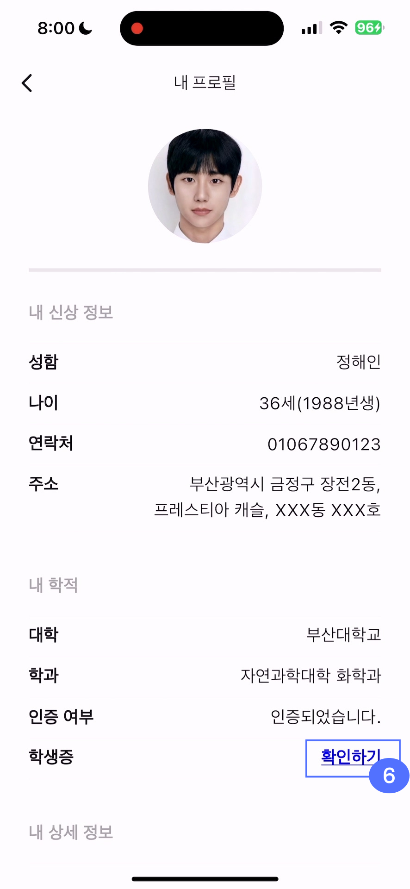
    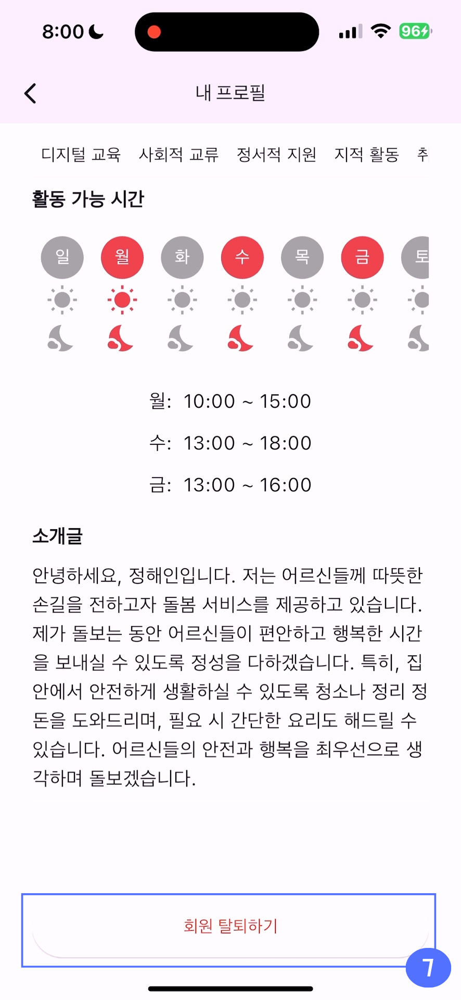

    |라벨|이름|상세|
    |:---:|:----------------------------:|:---|
    | 1  |본인 정보           | - 자신의 이름과 프로필 사진, 유저타입 정보이다.
    | 2  | 내프로필 버튼  | - 클릭시 내프로필로 이동한다.
    | 3  | 활동기록 버튼 | - 클릭시 활동기록페이지로 이동한다. <br> - 활동기록 페이지에서는 완료한 활동기록을 볼 수 있다. |
    | 4  | 고객센터             | - 고객센터 페이지로 이동한다.
    | 5  | 로그아웃 버튼  | - 클릭시 즉시 로그아웃 된다.
    | 6  | 학생증 확인하기 버튼             | - 클릭시 인증된 자신의 학생증을 보여준다.
    | 7  | 회원탈퇴하기 버튼             | - 클릭시 정말 회원을 탈퇴할 것인지 묻는 창이 뜨며 확인을 클릭하면 회원이 정상적으로 탈퇴된다.

    <br>
    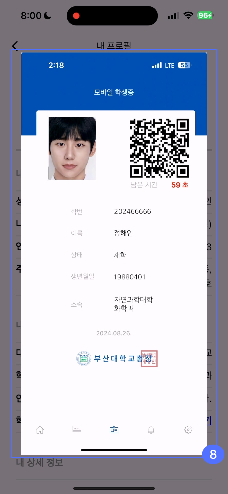
    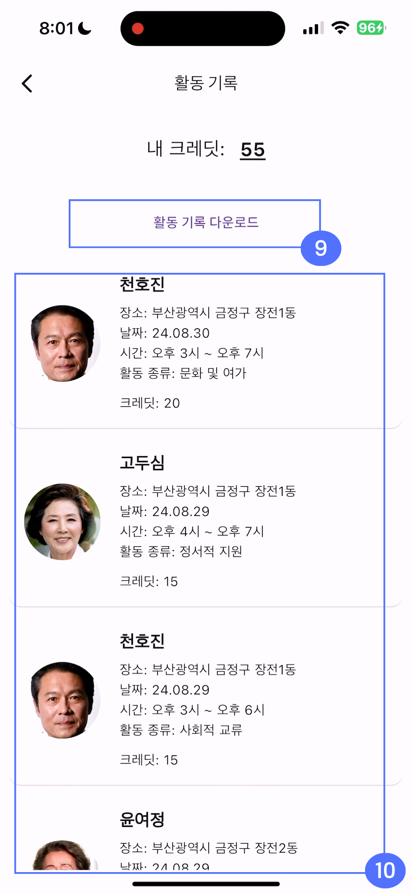
    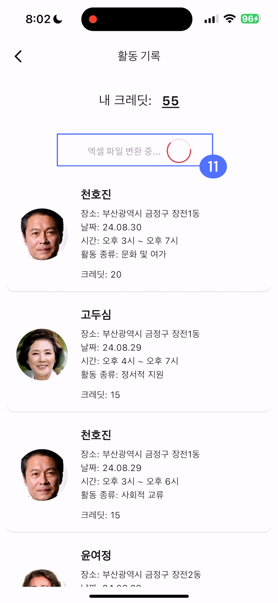

    |라벨|이름|상세|
    |:---:|:----------------------------:|:---|
    | 8  |학생증 정보           | - 자신이 회원가입시 등록한 학생증을 확인할 수 있다.
    | 9  | 활동기록 다운로드 버튼  | - 클릭시 활동기록에 대한 정보를 엑셀로 변환하여 다운로드 받는다.
    | 10  | 활동기록 목록 | - 지금까지 정상적으로 완료한 활동들의 기록을 볼 수 있다. |
    | 11  | 활동기록 다운로드 로딩             | - 활동기록 다운로드 버튼을 클릭시 이와같이 조금의 시간동안 활동기록을 엑셀파일로 변환하는 시간을 가지게 된다. 이후 변환된 엑셀파일을 받을 수 있다.

    <br>
    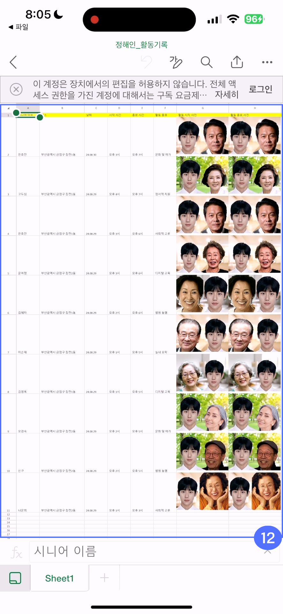
    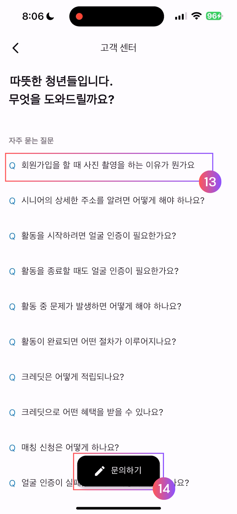
    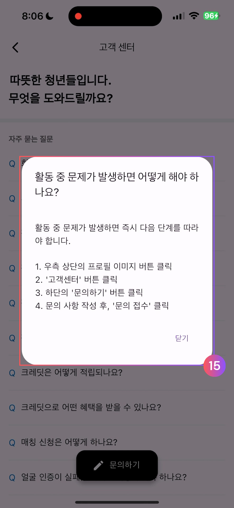

    |라벨|이름|상세|
    |:---:|:----------------------------:|:---|
    | 12  |엑셀파일 정보           | - 자신이 내려받은 엑셀파일의 전체 정보를 확인할 수 있다.
    | 13  | Q&A 자주묻는 질문들  | - 클릭시 자주묻는 해당 질문에 대한 공식 답변을 알 수 있다.
    | 14  | 문의하기 버튼 | - 클릭시 문의하기 페이지로 이동한다. |
    | 15  | Q&A 공식답변 | - 자주묻는 해당 질문에 대한 공식 답변이다. |

    <br>
    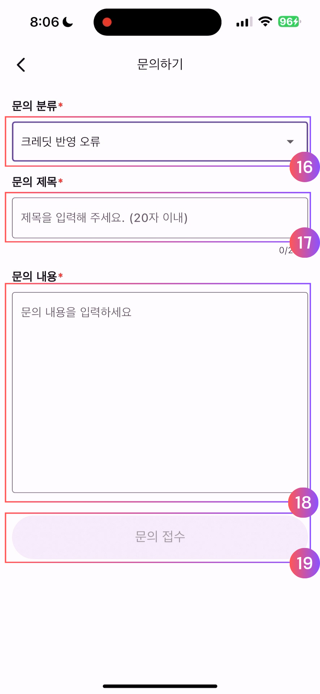
    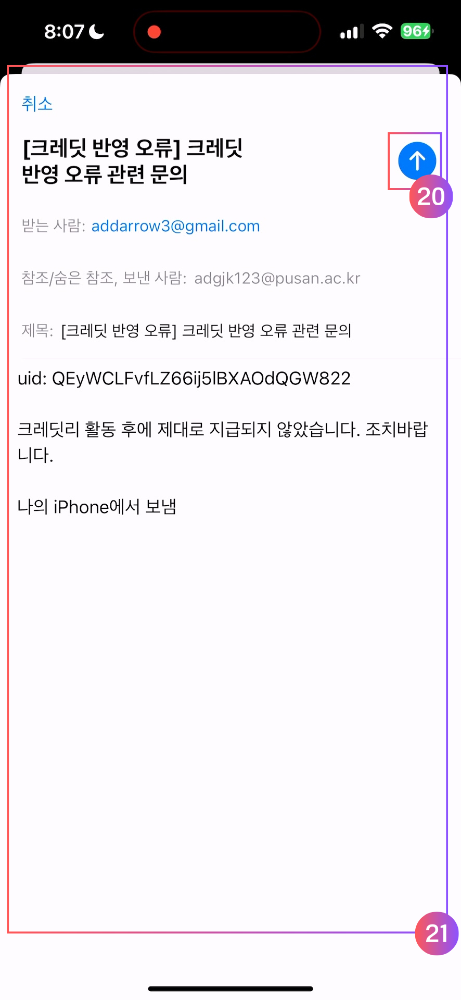

    |라벨|이름|상세|
    |:---:|:----------------------------:|:---|
    | 16  |문의분류 선택           | - 문의할 주제를 선택한다.
    | 17  | 문의제목 입력란  | - 문의할 사항에 대한 제목입력란이다.
    | 18  | 문의내용 입력란 | - 문의할 구체적인 내용을 적는 입력란이다. |
    | 19  | 문의접수 버튼 | - 모든 문의 입력란을 작성하면 활성화 된다. <br> - 활성화 된 문의접수 버튼을 클릭시 문의 내용이 이메일형식으로 변환되며 이를 보낼 수 있다. |
    | 20  | 이메일 전송 버튼 | - 클릭시 해당 문의 메일을 고객센터로 보낸다. |
    | 21  | 이메일 정보 | - 자신이 보낼 문의 메일의  정보이다. |
<br/>

#### 3.4. 산업체 자문내용 및 중간발표 피드백 반영사항
<br>

- 산업체 자문내용
  > 창의융합 SW해커톤 본선 초기에 저희는 산업체 자문을 받았고, 그에 따른 내용은 다음과 같습니다.
        
        소속: 삼성SDS
        직위: 수석 컨설턴트
        성명: 윤OO
        
        아이디어 평가:
        “국민적 공감대가 형성되어 있는 노인 돌봄 이슈 해결을 위해 부산시 공공기관과의 협력을 통하여 플랫폼화 한다는 아이디어가 우수함.”
        “기본 기능뿐만 아니라 매칭 기능, 프로필 기능 등 돌봄매칭플랫폼 특화기능이 포함되어있어 차별성과 경쟁력을 보유하고 있으므로 사업화 가능할 것으로 평가됨.”

        피드백 내용:
        1. 개발 목표/주요기능에서 나열된 필요기능 각각에 대하여 실제 구현시 필요로 하는 기술요소에 대한 상세조사를 권장
        2. 예산비용적, 사업화 측면의 제한사항에 대한 추가 검토를 통하여 예상 가격정책(요금제) 사전 검토를 권장
        3. 국내의 다수의 봉사단체(조직)에서도 고령층 노인분들과 독거 노인 등에 대한 봉사활동을 진행하고 있으므로 활용방안에 고려를 권장함. (예: 적십자봉사원, 1365자원봉사포털)
        4. 최종 단계에서의 Fail판정(출시불가) 위험을 예방하기 위해서 업무를 내용/일정/담당자 등을 기준으로 그룹핑하고 중간 점검/검토/리뷰를 실시할 것
        
  >위와 같은 피드백을 다음과 같이 반영하였습니다.
<br>

  1. 개발 목표/주요기능에서 나열된 필요기능 각각에 대하여 실제 구현시 필요로 하는 기술요소에 대한 상세조사를 권장
     > ‘사진 업로드 및 이용’, ‘활동 기록 엑셀 파일 다운로드’, ‘교육 영상’, ‘채팅’, ‘알림’, ‘얼굴 인증’, ‘얼굴 인증’ 기능을 구현하기 전에 사전 조사를 진행했습니다. ‘사진 업로드 및 이용’, ‘활동 기록 엑셀 파일 다운로드’, ‘교육 영상’, ‘알림’ 기능은 flutter 기본 패키지와 firebase를 사용해서 구현할 수 있었습니다. ‘얼굴 인증’ 기능에서 얼굴을 인식하는 과정은 flutter 기본 패키지인 google mlkit를 사용하여 구현할 수 있었지만, 얼굴 특징 벡터 값을 추출하는 기능은 별도의 TensorFlow 모델을 사용해야했습니다. 여러 모델들을 검토한 결과, 모바일에서 빠르게 동작할 수 있으며, 필요 리소스가 적은 FaceNet 모델을 선정했습니다. 이후 앱 제작 단계에서 성공적으로 얼굴 인증 기능을 구현할 수 있었습니다.
<br>

  2. 예산비용적, 사업화 측면의 제한사항에 대한 추가 검토를 통하여 예상 가격정책(요금제) 사전 검토를 권장
     > 사업화 관련 피드백 반영 사항은 아래 중간발표 피드백 5번 참조하시길 바랍니다.
<br>
        
  3. 국내의 다수의 봉사단체(조직)에서도 고령층 노인분들과 독거 노인 등에 대한 봉사활동을 진행하고 있으므로 활용방안에 고려를 권장함. (예: 적십자봉사원, 1365자원봉사포털)
     > 금정구노인복지센터에 직접 방문하여 노인 복지 전문 사회복지사분들로부터 직접 공공기관 서비스와의 연계 방향과 수정이 필요한 사항에 대한 면담을 진행했습니다. 자세한 내용은 아래의 ‘공공기관 피드백’ 항목을 참조하시길 바랍니다.
<br>
        
  4. 최종 단계에서의 Fail판정(출시불가) 위험을 예방하기 위해서 업무를 내용/일정/담당자 등을 기준으로 그룹핑하고 중간 점검/검토/리뷰를 실시할 것
     > 마감 기한 내 프로젝트 결과물을 완성하지 못하는 상황을 방지하기 위해서 프로젝트 초기에 기획팀과 개발팀을 나누고 인원을 배정했습니다. 각 팀은 팀별 회의를 일주일에 한 번 이상, 전체회의를 일주일 한 번 이상 진행함으로써 활발히 의견을 교류하고 유동적으로 역할을 분담했습니다. 또한 notion 상에서 수행해야 할 작업들을 ‘진행 전’, ‘진행 중’, ‘완료’ 세 가지 상태로 나누고 캘린더 상에 표시함으로써 전체적인 진행 상황을 파악할 수 있도록 했으며, 문제 해결과정에서 새롭게 알게 된 정보들을 문서로 작성하여 팀원들과 공유했습니다. 결과적으로 개발 소요 시간을 크게 단축시킬 수 있었고, 프로젝트를 마감기한 내 끝낼 수 있었습니다.

<br>

- 중간발표 피드백 사항
  > 중간발표 당시, 저희는 따시게의 보완점과 향후 공공기관 연계 가능성 등에 대한 피드백을 받았고, 해당 피드백에 관한 개선 방안을 탐구하기 위해 관련 공공 복지 사업(노인 맞춤 돌봄 서비스)을 운영하고 있는 금정구 노인복지관을 방문하였습니다. 그리고 노인 맞춤 돌봄 서비스 사업을 관리, 감독하고 계시는 관련 복지 담당자님 두 분과 인터뷰를 진행하였습니다. 그 결과, 중간발표 피드백과 담당자님 인터뷰를 취합하여 다음과 같은 피드백 사항들을 도출할 수 있었습니다. <br>
  >
  > 
  > 
  >
  > - 장소: 금정구노인노인복지관
  > - 일시: 2024.08.28, 16:00 ~ 17:30 (1시간 30분간)
  > - 활동 내용: 노인 전문 사회복지사, 공공 복지 서비스 담당자와의 면담 진행


  1. 공공기관과의 연계성 검토
    > 공공 복지 사업의 대상이 되는 노인분들과 공공 기관에서 근무하는 복지사분들을 따시게에 유입시키는 것에 대한 피드백입니다. 구체적으로, 기존 공공 복지 서비스의 유저층을  따시게에 인계하고, 공공 복지 서비스에서 비슷하게 진행하고 있는 일련의 돌봄 활동을 따시게를 통해 진행할 수 있는지에 대해 검토하는 것입니다. 이는 중간평가 당시 저희가 받은  주요 피드백 중 하나였습니다. 이러한 연계가 가능하다면, 플랫폼 사용자의 인증 부담 완화와 기존 공공 복지 서비스의 디지털화가 가능할 것이라는 가정하에, 앞선 개요 설명과 같이 금정구 노인복지관에 방문하여, 인터뷰를 통해 연계성을 검토하였습니다. 하지만, 공공 복지가 불특정 다수가 아닌 특정 요양 필요 노인분들을 대상으로 한다는 점에서, 저희가 구상한 따시게의 시니어 유저와 차이점이 분명했습니다. 또한, 기존의 공공 복지 서비스에도 보건복지부 주도의 디지털화가 진행되어 있는 상황이었습니다. 따라서 공공기관과의 연계성은 따시게의 사업화 가능성과 연결시켜 이후 5번 피드백(향후 사업성 검토)을 참고 부탁드립니다. 공공기관과의 연계성 검토 외에 추가로, 기존 복지 서비스에 대한 정보를 따시게로 제공한다면 시니어 유저의 편의성 증가 측면에서 도움이 될 것이라고 판단하여, 중간 평가 당시, 시니어 화면에 존재했던 리워드 탭을 수정하여 기존 복지 서비스 정보를 제공하는 서비스 탭으로 수정하였습니다.
  <br>

  2. 사용자 인증 강화
    > 사용자 인증에 관한 사항은 플랫폼 신뢰성과 연결됩니다. 저희가 제공하고자 하는 돌봄 서비스는 플랫폼 내의 매칭을 바탕으로 실제 돌봄 활동까지 이어지기에, 플랫폼에 진입하고자 하는 불특정 사용자들의 신원을 확인하고 인증하는 것이 중요할 수 밖에 없습니다. 따라서 저희는 위와 같은 피드백을 반영하여, 따시게에 메이트 회원 가입 시, 학생증 인증을 하는 기능을 도입하였고, 해당 기능을 통해 유저 간의, 그리고 플랫폼에 대한 신뢰도를 향상 시킬 수 있었습니다.
  <br>


  3. 리워드 구체화
    > 메이트의 리워드와 관련된 피드백입니다. 메이트는 돌봄 활동을 마친 후 크레딧을 지급받게 되는데, 해당 크레딧을 리워드로 교환할 수 있습니다. 리워드는 돌봄 서비스 제공을 위한 메이트 유저를 확보하는 주요 서비스 중 하나입니다. 다만, 중간발표 당시 리워드 요소에 대한 구체성이 다소 부족하다는 피드백을 받았고, 담당자님과의 인터뷰 시에도 메이트 유저가 플랫폼을 이용할 수 있는 메리트가 추가됐으면 한다는 의견을 받았습니다. 이러한 피드백을 반영하여, 저희는 따시게 리워드 항목에 기존의 기업 제품, 장학금과 유사한 복지 재단 후원금과 더불어 메이트의 봉사 시간 인증 (1365봉사포털), 돌봄 활동 기록 인증서 발급을 추가했습니다. 위와 같은 추가적인 리워드 요소는 메이트의 스펙으로 사용될 수 있습니다.
  <br>

 
  4. 돌봄 서비스 특정
    > 기존 따시게에서 제공하는 돌봄 활동을 특정하는 것에 관한 피드백입니다. 저희가 따시게를 구상할 당시, 돌봄 활동에 간단한 식사 준비와 같은 가사 활동을 포함시켰습니다. 하지만 담당자님과 인터뷰를 진행하며, 이러한 돌봄 활동 범위에 대한 모호성이 플랫폼 운영에 여러 부작용을 야기할 수 있을 것이라는 의견을 받았습니다. 이를테면, 단순히 가사 활동이 포함되는 것만으로 예상했던 돌봄 활동의 강도를 넘어선 청소, 요리 같은 가사 노동에 대한 요구가 발생할 것이며, 이것이 메이트 유저와의 입장 차이로 인한 불화 및 플랫폼에 대한 컴플레인 등으로 발전할 여지가 있습니다. 이러한 부분은 저희가 초기에 생각했던 간단한 돌봄 서비스 제공이라는 취지에 적합하지 않기 때문에, 돌봄 활동에서 가사 노동을 모두 배제하고, 공공기관에서도 수요가 많은 병원 동행, 스마트폰 이용 교육 같은 활동에 집중하도록 하였습니다.
  <br>


  5. 향후 사업성 검토
    > 따시게의 향후 사업성에 대한 피드백입니다. 따시게 자체가 플랫폼 기반의 서비스이기 때문에, 지속적인 운영에 있어서 서버 운영, 플랫폼 관리 측면의 금전적 비용이 발생할 수 밖에 없습니다. 따라서 서비스 사업성에 관한 검토는 필수적입니다. 담당자님 인터뷰 당시, 현재 공공기관에서 진행중인 맞춤 노인 돌봄 서비스 역시 보건복지부가 발주한 소프트웨어 솔루션을 민간 업체로부터 제공받아 활용 중에 있었습니다. 해당 소프트웨어 솔루션에는 따시게와 유사하게, 실제 복지사 분들이 돌봄 활동 중에 사용할 수 있는 GPS 기반 활동 인증, 돌봄 일지 작성 서비스 등이 포함되어 있습니다. 담당님께서는 이런 예시를 들어, 저희 따시게가 접근성과 취지의 측면에서 현재의 공공 사업과의 차별성이 존재하기에, 정부 기관과의 연계를 통한 공공 복지 성격의 사업 출원을 하면 경쟁성을 가질 수 있을 것이라는 자문을 받았습니다.
<br>
            
#### 3.5. 디렉토리 구조
```
├── docs/                       # 따시게 관련문서
├── function/                   # firebase function 설정 파일
├── WarmBoysApp/                # 따시게 flutter 프로젝트
│   ├── assets/                 # 이미지, 폰트, 아이콘 등의 정적 파일
│   │   ├── fonts/              # 폰트
│   │   ├── icons/              # 아이콘
│   │   ├── images/             # 이미지
│   │   ├── logos/              # 앱 로고
│   │   ├── models/             # AI 모델
│   │
│   ├── lib/                    # 소스코드
│   │   ├── screens/            # 실제 기능하는 주요 페이지들
│   │   │   ├── activity/                   # 활동 화면
│   │   │   ├── chatting/                   # 채팅 화면
│   │   │   ├── history/                    # 활동 기록 화면
│   │   │   ├── index/                      # 인덱스 화면
│   │   │   ├── main/                       # 홈, 채팅, 매칭, 서비스, 교환, 교육 화면
│   │   │   ├── notification/               # 알림 화면
│   │   │   ├── post/                       # 공고 화면
│   │   │   ├── profile/                    # 프로필 화면
│   │   │   ├── register/                   # 회원가입 화면
│   │   │   ├── review/                     # 리뷰 화면
│   │   │   ├── service/                    # 고객센터 관련 화면
│   │   │   ├── login_screen.dart           # 로그인 화면
│   │   │
│   │   ├── utils/              # 복잡한 기능, 연결등을 간소화 하는 함수파일모음
│   │   ├── widgets/            # 여러 페이지에서 사용되는 위젯 컴포넌트
│   │   ├── providers/          # custom auth provider
│   │
│   ├── build/                  # 앱의 공통적인 설정과 파이어베이스 연결등을 담당
│   ├── android/                # 안드로이드 앱으로 빌드시 필요한 세팅 담당
│   ├── ios/                    # ios 앱으로 빌드시 필요한 세팅 담당
│   ├── firebase_options.dart   # firebase 설정
│   ├── main.dart               # main
```
<br/>


### 4. 설치 및 사용 방법
#### 4.1 필요 패키지
| 이름                  | 버전    |
|:---------------------:|:-------:|
| cloud_firestore | 5.1.0 |
| cocoapods       | 1.15.2 |
| cupertino_icons | 1.0.6 |
| dart            | 3.4.3 |
| firebase_auth | 5.1.2 |
| firebase_core | 3.2.0 |
| firebase_messaging | 15.0.3 |
| firebase_storage | 12.1.2 |
| flutter             | 3.22.2  |
| flutter_email_sender | 6.0.3 |
| google_mlkit_commons | 0.7.1 |
| google_mlkit_face_detection | 0.11.0 |
| image | 4.1.3 |
| image_picker | 1.0.4 |
| provider | 6.0.0 |
| ruby                 | 2.6.10p210 |
| table_calendar | 3.1.2 |
| tflite_flutter | 0.10.4 |
| xcode                | 15.0 |
| youtube_player_flutter | 8.0.0 |

#### 4.2 설치 및 실행
- 안드로이드
```bash
$ git clone https://github.com/pnusw-hackathon/PNUSW-2024-team-03.git  # 프로젝트 다운로드
$ cd PNUSW-2024-team-03/WarmBoysApp                                    # flutter 프로젝트 디렉토리 접근
$ flutter pub get                                                      # flutter 패키지 다운로드
$ flutter run                                                          # 가상 모바일 기기 or 실제 휴대폰 usb디버깅
```

- IOS(Apple Silicon, macos_arm64)
```bash
$ git clone https://github.com/pnusw-hackathon/PNUSW-2024-team-03.git  # 프로젝트 다운로드
$ cd PNUSW-2024-team-03/WarmBoysApp/ios                                # flutter 프로젝트 IOS 디렉토리 접근
$ sudo arch -86_64 gem install ffi                                     # gem 설치(macos_arm64)
$ sudo gem install cocoapods                                           # cocoapods 설치
$ pod init                                                             # Podfile 생성
$ cd ..                                                                # flutter 프로젝트 디렉토리 복귀
$ flutter pub get                                                      # flutter 패키지 다운로드
$ flutter run                                                          # 가상 모바일 기기 or 실제 휴대폰 usb디버깅
```
<br/>


### 5. 소개 및 시연영상
[](https://youtu.be/GvQhqcAZocE)
> 재생 화질을 '1080p60'으로 설정해주세요.

<br/>

### 6. 팀 소개

### 따뜻한 청년들2
> 저희 따뜻한 청년들2 팀은 다양한 전공을 가진 6명의 청년들이 모여, 사회적 문제 해결을 위해 협력한 팀입니다. 고령화 사회에서의 노인 돌봄 공백 문제를 해결하기 위한 창의적이고 실용적인 솔루션인 따시게를 개발하였습니다. 팀원들은 구체적인 기획, 개발 등 역할을 맡아 프로젝트 전반을 책임감 있게 이끌었으며, 협업을 통해 이번 창의융합SW해커톤의 따시게 프로젝트를 완수할 수 있었습니다.

| 안성수 | 홍태근 | 정솔빈 | 임정근 | 김상준 | 하수형 |
|:-------:|:-------:|:-------:|:-------:|:-------:|:-------:|
| |  |  |  |  |  
| tosun1124@naver.com | addarrow3@gmail.com | balbalbin@naver.com | dokd0korea94@gmail.com | kbw7575@naver.com | dphsh514@naver.com | 
| 정보컴퓨터공학과 <br/> 백엔드 개발 | IT응용공학과 <br/> 프론트엔드 개발 |  IT응용공학과 <br/> 프론트엔드 개발 | IT응용공학과 <br/> 기획 | 언어정보학과 <br/> 기획 | 기계공학과 <br/> 기획 | 

<br/>

### 7. 해커톤 참여 후기

- 김상준 (언어정보학과)
    >큰 물줄기 두 갈래가 뇌리를 가로질렀습니다. 세상을 변화시키는 가장 효과적인 방법은 기술이고 다른 하나는 태도입니다. 개발 전공자들과 함께 프로젝트를 진행하며 플러터, 파이버 베이스와 같은 개발프로그램에 대한 지식과 경험도 쌓을 수 있었지만, 그동안 삶 속에서 구가하던 서비스들이 코드 한 줄, 한 줄이 겹겹이 쌓여 일구어낸 세상이라는 걸 느낍니다. 팀 작업을 통해 그동안 대학에서 경험할 수 있었던 조별 과제와는 그 수준과 요구되는 역량의 시작점이 달랐습니다. 실사용이 가능한 수준의 개발 역량과 디자인, 정보 수집 능력 등 많은 역량을 요구하였습니다. 기술의 사용처를 결정짓고 사용자들을 배려하기 위해선 태도가 필요합니다. 작은 것에서부터 큰 결정 사항까지 팀원들과 머리를 맞대어 회의하고 도출해 낸 서비스라는 생각에 위험한 확신을 품게 만듭니다. 우리의 서비스는 ‘노인 부양 가구의 복지 사각지대 해결’이라는 문제 정의로 강한 확신을 가지며 접근했지만, 실제 복지 업무 종사자분의 이야기를 들으며 상당히 현실과 다른 지점, 예를 들어 최근의 노인분들은 자녀분들과 함께 있는 걸 원하지 않고 또 노인 부부의 비중 또한 상당하다는 것, 실제로 노인분들은 스마트폰 교육 및 병원 동행이라는 실질적으로 수요가 있는 서비스에 대해서도 파악할 수 있었습니다.
이러한 자기 확신에서 벗어나기 위한 좀 더 겸손하고 경청하는 태도가 필수적입니다.
이번 대회는 단순히 이런 경험도 해보았다. 라고만 끝나는 대회가 아니게 되었습니다.
해커톤을 통해 좀 더 진취적인 관심이 생겼고, 삼성에서 주관하는 삼성 소프트웨어 아카데미 일명 SAFFY에 지원하고자 합니다. 이를 통해 IT, 개발자 방향으로 미래 설계를 도전하게 되는 계기가 되었습니다.
- 하수형 (기계공학과)
    >이번 SW 해커톤에서 처음으로 앱 개발에 도전하게 되었습니다. 비전공자로서 이러한 경험은 다소 낯설기도 했지만, 동시에 매우 신선한 도전이었습니다. 앱 기획을 맡아 첫 작업으로 플로우 차트를 제작했는데, 이를 위해 여러 앱을 분석하고 직접 사용해보면서 "이 버튼이 왜 여기에 있을까?"라는 질문들이 자연스럽게 떠올랐습니다. 특히 노인분들이 사용할 앱이기에, 사용의 편의성을 최우선으로 고려해 개발해야 했습니다. 이 과정에서 기술적인 이해뿐만 아니라, 사용자 경험을 고려한 기획의 중요성을 깊이 깨달았습니다. 대회를 준비하며 저희 앱의 이름처럼 ‘따시게’ 따스한 마음을 담아 사용자의 관점에서 앱을 살펴보고 개선하려고 노력했습니다. 이번 해커톤에서 팀원들과 함께 배운 것들이 앞으로 SW 개발을 하거나 관련 프로그래머와 협업할 때 큰 도움이 될 것이라고 확신합니다.
- 안성수 (정보컴퓨터공학과)
    >생각보다 정말 많은 것을 배웠고 경험했습니다. 지금까지 몇몇 과목에서 작은 프로젝트는 해보았지만 실제로 배포가 가능할 정도의 서비스를 구현하는 경험은 처음이었습니다. 앱 설계부터 회의의 연속이었습니다. 정말 많은 회의를 거듭하면서 점점 발전해 나가는 저와 팀원들을 볼 수 있었습니다. 점점 아이디어는 구체화되었고, 그냥 회의만 할 때보다 실제로 개발해 나가면서 회의를 하면서 실제로 구현에 문제가 있는 부분들을 직접 접하면서 회의에 녹일 수 있어서 개발에 있어서 새로운 측면들을 발견해 갈 수 있었습니다. 팀원 6명중에 3명이 개발팀 3명이 기획팀으로 나누어져서 개발을 진행하였습니다. 진행하면서 팀 간의 소통과 협업, 팀 안에서의 일 할당과 서로 돕는 경험을 하면서 조금이지만 팀 프로젝트가 어떤 것인가를 엿볼 수 있었습니다. 서비스 개발에 있어서 실제로 구현하는 것도 중요하지만 기획과 팀 내의 소통도 못지않게 정말 중요하다는 것을 느낄 수 있었습니다. 너무 너무 값진 경험이었고, 저의 앞으로의 행보에 큰 영향을 줄 것 같습니다.
- 홍태근 (IT응용공학과)
    > 이번 프로젝트에서 회원 얼굴 사진으로 활동 인증을 하는 기능 구현을 담당했습니다. AI에 대한 이해도를 높이기 위해서 프로젝트 기간 도중 3주간 산학협동재단과 서울대학교의 데이터사이언스 대학원이 주관하는 AI 인턴십 과정을 수료했으며, 인턴십에서 얻은 AI 지식으로 AI 얼굴 인식 및 인증 기능을 성공적으로 구현할 수 있었습니다.
 또한 시연 영상 제작을 맡았으며, 영상 제작 경험이 전무했던지라 조금 고생했지만, 추후 공모전이나 타 대회에 출전했을 때 사용할 수 있는 기술이 늘었기 때문에 뜻깊은 경험이 된 것 같습니다.
 팀원들과 자료를 조사하고 개발 방향을 논의하는 과정에서 노인 돌봄 문제가 사회적으로 얼마나 큰 문제인지 실감하게 되었고, 청년층과 고령층이 모두 사용할 수 있는 매칭 플랫폼을 만들면서 개발 역량과 문제해결 능력을 기를 수 있었습니다.
- 정솔빈 (IT응용공학과)
    > 이번 SW해커톤에서 채팅, 알림과 같은 부가 기능 구현을 맡았습니다. SW관련 전공임에도 불구하고, 실제로 앱을 개발하는 것이 처음이라 기능 구현에 있어서 어려움이 적지 않았습니다. 하지만 그 어려움을 극복하는 과정에서, 전공에서 배운 것들을 적용하고 응용하는 경험을 할 수 있었습니다. 이론적인 전공 지식을 응용의 과정에 적용시키는 경험은, 그것만으로도 지금까지의 배움, 향후 진로에 대한 충분한 자신감이 될 것이라는 확신을 주었습니다. 그러나 이런 경험 이외에도, 다양한 전공을 가진 팀원들과 회의를 진행하며, 각자가 무언가를 바라보는 관점이 다르다는 것을 실감할 수 있었습니다. 같은 아이디어에서도 누군가는 구현 가능성을, 누군가는 그것이 가져다 줄 사회 가치를 먼저 떠올렸습니다. 내가 먼저 떠올리지 못하는 것을 팀원으로부터 공유받는 경험은 전문성의 이면에 존재할 수 있는 제한된 시각을 열어주었습니다. 전문성과 협업으로 대표되는 이러한 두 경험이 앞으로의 제 진로 발전에 도움을 줄 것이라고 자신합니다.
- 임정근 (IT응용공학과)
    >이번 SW 해커톤에 참여하며 SW 전공자와 비전공자가 팀을 이루어 협업하는 소중한 경험을 했습니다. 각자의 배경이 달라 처음에는 어려움이 있었지만, 서로의 장점을 살리며 문제를 해결하는 과정에서 팀워크의 중요성을 깨달았습니다.
주제는 지역사회 문제 해결이었고, 우리는 환경 문제를 인식하여 컴퓨터적인 사고로 아이디어를 구상했습니다. 문제 정의와 데이터 분석을 통해 해결책을 제시하는 과정에서 많은 것을 배웠습니다.
부산대학교 소프트웨어융합교육원에 감사드리며, 이번 경험이 앞으로의 발전에 큰 도움이 될 것이라고 생각합니다. 모든 참가자와의 시간은 잊지 못할 소중한 기억이 되었습니다.
