### 1. 프로젝트 소개
#### 1.1. 개발배경 및 필요성
- 개발배경 <br/>
  
  > 대한민국의 고령화 문제가 심화되고 있다. 베이비붐의 사회 은퇴 시기와 더불어, 저출산이 지속되며 대한민국의 노인 인구 증가 속도는 OECD 회원국 중 가장 빠른 것으로 나타난다. 2024년 기준 대한민국의 65세 이상 고령 인구는 973만명으로, 전체 인구의 19%에 달하고, 고령 인구는 지속적으로 증가하여 '36년에는 1574만명이 될 것으로 통계청은 예상했다. 특히, 우리 부산 광역시의 경우 이미 고령 인구 비율이 60%를 초과한 초고령사회에 진입했으며, 한국고용정보원에서 발간한 자료에 따르면, 부산광역시의 고령화는 다른 어느 지자체들보다도 빠르게 진행되고 있음을 나타냈다.


- 개발필요성
  > 이와 같은 노인 인구 증가와 더불어 노인 돌봄 공백 문제 역시 커져만 가고 있다. 신체적 노화로 인해 그 능력이 다소 떨어지는 노인의 경우, 안정된 생활을 위해 주변 가족와 사회의 도움이 절실하다. 그럼에도, 사회의 여러 변화로 돌봄 공백 문제는 심화되고 있는 현실이다. 
 
    1. 사회적 비용 증가
        > [통계청](https://www.index.go.kr/unity/potal/main/EachDtlPageDetail.do?idx_cd=1430)에서 발표한 노년부양비(총인구중 생산가능인구에 대한 고령인구의 백분비)의 경우, 2010년에는 생산가능인구 6.7명이 노인 1명을 부양하였으나, '18년에는 5.1명, '30년에는 2.6명, '50년에는 1.3명으로 지속적으로 증가할 것이다. 한국의 노년부양비는 2030년부터 선진국보다 높아질 것으로 예상됐는데, 이로 인해 노인인구 부양을 위한 생산가능인구의 조세, 사회보장비와 같은 사회적 비용의 증가는 불가피할 예정이다. 추가로 이로 인한 세대 간 갈등까지 발생할 수 있다.
    2. 노인 돌봄 인력의 부족 <br/>
       
       > 통계청에 따르면, 노인 돌봄 인력의 공급 부족은 이미 2022년에 19만명에 달했고, '42년에는 최대 155만명의 돌봄 인력 공급 부족이 발생할 것으로 분석했다. 그에 따른 노인 돌봄에 필요한 서비스의 공백 역시 크게 증가할 것으로 예상된다.
          

    4. 복지 사각 지대 증가
        > 1인 가구의 증가로 복지 사각지대가 점점 늘어나고 있다. 특히나 독거노인의 비율은 과거부터 꾸준히 증가하여, 현재에는 노인 5명 중 1명이 독거노인, 즉 복지 사각지대에 놓여있다고 [통계청](https://www.index.go.kr/unify/idx-info.do?idxCd=8039)은 발표했다.
    
    위와 같은 돌봄 공백의 문제를 단순히 통계로 뿐만 아니라, 일상에서도 접할 수 있다. 바로 안내문자이다. 부산에서도 매일매일 실종된 고령의 노인을 찾는다는 안내문자를 받아볼 수 있다. 
    > [해운대구 주민인 노영찬씨(남,76세)를 찾습니다-163cm,60kg,파란색티,검정바지,검정신발,흰머리 부산경찰청](https://www.safekorea.go.kr/idsiSFK/neo/sfk/cs/sfc/dis/disasterMsgView.jsp?menuSeq=679&md101_sn=223118)
  
    이렇듯 나날이 심화되고 있는 노인 돌봄 공백의 문제를 SW를 통해 완화시키고 해결하고자 한다.
  

#### 1.2. 개발목표 및 주요내용
- 개발목표<br>
  **‘노인 돌봄 공백 해소’**
   > 해당 서비스의 개발 목표는 바로 노인 돌봄 공백 해소이다. 노인 돌봄 매칭 플랫폼을 앱 형식으로 개발하여, 간단한 돌봄 서비스를 제공하는 것이다. 이는 우리 부산대학교에서 진행하고 있는 여러 멘토링 시스템과 유사하다. 전문 간병 인력이나 사회 복지 인력이 아닌 대학생 위주의 청년층을 플랫폼에 유입시켜, 간단한 돌봄 서비스를 제공하도록 하는 것이다. 서비스 개발을 통해 노인 돌봄 공백 해소 이외에도 청년층의 사회 복지 참여를 독려하고 세대 간의 이해를 증진을 통한 갈등 완화에도 효과를 가질 것으로 기대한다.
 
- 주요내용
  > 우선 서비스 내에는 두 가지 주요 유저 타입이 존재한다. 바로 돌봄 서비스를 제공받는 노인층과 돌봄 서비스를 제공하는 대학생 중심의 청년층이다. 따라서 서비스 내에서 노인층을 시니어로, 청년층을 메이트로 정의하여 다음과 같은 주요 서비스를 제공한다. 
  1. 돌봄 매칭 서비스:
     > 시니어가 필요로 하는 돌봄 서비스를 작성하여 메이트를 모집할 수 있도록 하는 서비스이다. 플랫폼의 역할을 하는 핵심적인 기능이며, 메이트는 시니어가 올린 공고에 신청을 넣어 돌봄 활동을 개시할 수 있도록 한다.
  2. 리워드 서비스:
     > 메이트는 활동을 완료한 후 크레딧을 지급받게 된다. 해당 크레딧을 후에 연계된 기업과 대학교가 제공하는 여러 리워드와 교환할 수 있게끔 하여, 메이트의 플랫폼 유입을 독려하여 최종적으로 플랫폼 선순환을 이끌어낸다.
  3. 피드백 서비스:
     > 플랫폼 내 전체적인 서비스 질을 높이기 위한 서비스이다. 유저 간 피드백 뿐만 아니라 사용자의 플랫폼에 대한 피드백을 가능하도록 하여 서비스 신뢰도와 질을 높일 수 있도록 한다. 
  4. 인증 서비스:
     > 서비스 안정도를 높이기 위한 서비스이다. 실제 돌봄 활동를 위해서는 사용자 간의 신뢰가 우선되어야 한다. 그에 따른 사용자에 대한 인증을 포함하며, 크레딧 및 리워드 시스템에 대한 신뢰성을 높이기 위한 돌봄 활동에 관한 인증이 포함된다. 또한, 해당 서비스에는 메이트가 본인의 활동 내역을 인증할 수 있는 서비스 역시 포함된다. 
  5. 교육 동영상 서비스: 
     > 플랫폼에 사용에 대한 교육 영상을 제공하는 서비스이다. 
  6. 여러 부가 서비스:
     > 플랫폼 이용에 편의성을 제공하는 여러 부가 서비스가 제공된다.
      
      


#### 1.3. 세부내용
  1. 돌봄 매칭 서비스
      > 플랫폼의 가장 핵심적인 서비스를 제공한다. 시니어가 작성한 공고를 바탕으로 메이트가 매칭될 수 있도록 하여, 돌봄 서비스가 실제로 이루어지기 전까지의 서비스가 제공된다. 시니어 측은 간단한 캘린더 형태의 위젯으로 공고를 작성할 수 있고, 메이트는 여러 필터를 활용하여 공고를 탐색하고 매칭을 신청하는 것이 가능하다. 매칭을 위해 상호 간의 리뷰, 활동 기록 등의 확인이 가능하다.
        
      - 시니어의 돌봄 공고 게시
         - 공고글 작성
          > 공고 작성 시, 필요한 돌봄 활동의 종류, 시작 및 종료 시간, 그 외 시니어 프로필이 상세히 기재되어 메이트가 신청을 넣는데 도움이 되도록 한다.
         - 시니어 사용 편의성
          > 시니어가 직관적으로 서비스를 이용할 수 있게끔, 시니어를 위한 UX 및 UI가 제공된다. UX적인 측면에서, 홈 페이지에서 모든 페이지로 이동이 가능하게끔 구성하고, 탭바 및 네이게이션 바를 적극 활용하여 페이지 간의 이동의 직관성을 높이고, 전체적인 폰트 크기 키우고, 눈에 잘 띄는 붉은 색감을 활용하여 디자인하였다.
            
       - 메이트의 공고 신청
          - 공고글 탐색
          > 공고 탐색 시, 메이트는 원하는 공고를 쉽게 찾을 수 있도록 날짜, 지역과 관련된 여러 필터를 활용할 수 있다. 뿐만 아니라 게시글 정렬이 가능하도록 하여 탐색에 대한 편의성을 높인다. 공고글 탐색 시, 시니어가 작성한 프로필과 여러 리뷰, 기록 등을 활용할 수 있다.

  2.    리워드 서비스
        > 메이트의 플랫폼 참여를 독려하기 위한 주요 서비스이다. 돌봄 활동을 마친 메이트가 크레딧을 지급받아, 해당 크레딧을 여러 리워드로 교환할 수 있다. 리워드는 서비스와 연계된 기업 측의 특정 제품이나, 기프티콘 등이 있고, 메이트가 대학생 중심의 청년층임을 감안하여, 학교 측에서 제공하는 장학금의 형태가 될 수 있다. 최종적으로 메이트의 돌봄 서비스와 플랫폼 참여를 이끌어내기 위한 서비스이다. 메이트는 특정 리워드 공고에 신청을 넣고 리워드를 제공 받으며, 크레딧이 차감된다.
    
  3.    피드백 서비스
        > 플랫폼에 대한 피드백 및 사용자 간의 피드백이 가능하도록 하여, 전체적인 플랫폼 내의 서비스 질과 신뢰성을 향상시키기 위한 서비스이다. 유저 간의 리뷰 서비스, 활동 보고서, 문의하기(고객센터) 서비스 등이 포함된다.
        
        - 유저 간 피드백
          > 별점 기반 사용자 평가: 활동을 마친 후 서로에 대해 별점(1점~5점)을 부여한다. 별점은 활동에서의 상호 간의 태도, 시간 준수 여부 등을 기준으로 평가된다.
          > 활동 보고서 작성: 돌봄 활동을 하며 발생했던 사건이나, 특별한 경험, 개선사항 등을 바탕으로 활동 보고서를 작성할 수 있다.
       
        - 플랫폼 피드백
          > 이외에도 플랫폼 피드백을 위한 문의하기 서비스가 제공된다. 직접적으로 플랫폼에 대한 불편점이나, 요구 사항 등을 플랫폼 운영진 측에 전달할 수 있다. 

  4. 인증 서비스
        > 활동을 무사히 마쳤음에 대한 인증, 회원 가입 시의 인증, 본인 활동 내역에 관한 인증을 포함하며, 여러 인증을 통해 서비스와 유저 간의 신뢰도를 높일 수 있다. 플랫폼 서비스라는 특성상, 대부분의 서비스가 신뢰를 바탕으로 이루어지고 있기 때문에 필수적인 서비스이다.
      
        - 활동에 대한 인증
            > 활동 시작 및 종료 시에 인증 절차가 진행된다. 돌봄 서비스가 성공적으로 개시, 종료되었음을 증명하기 위한 인증이며, 해당 인증에는 얼굴 인식 AI를 활용하여, 사진 한 장으로 시니어와 메이트가 돌봄 활동을 위해 대면으로 만났음을 인증할 수 있다.
        
        - 메이트의 가입 인증
            > 메이트의 경우, 대학생을 중심으로 하기에, 학교 학생증을 통해 인증을 할 수 있도록 한다. 이를 통해, 저택이나, 특정 장소로 시니어에 대한 돌봄 활동을 해야 하는 메이트 유저의 신뢰성을 확보하는데 도움을 준다. 
            
        - 활동 내역에 관한 인증
            > 메이트는 본인이 플랫폼 내에서 활동했던 기록에 대한 기록물을 인쇄하여 증빙 자료로 활용이 가능하다. 이를 활용하여 메이트가 향후 사회 활동 기여에 대한 증명이 가능할 것이며, 취업 혹은 여러 구직 활동 등에 사용할 수 있을 것으로 기대한다.
            
  5. 교육 동영상 서비스
        > 플랫폼 진입 전 필수적으로 이수해야 하는 교육 서비스이다. 플랫폼 이용 시 행동 규범과 주의 사항을 이해하고, 미 준수 시 발생하는 문제점을 사전에 인지하도록 돕기 위해 설계되었다.
        
  6. 여러 부가 서비스
        > 플랫폼 이용에 편의성을 더하기 위한 채팅, 알림, 기존 복지 정보 제공 등의 부가 서비스가 존재한다. 기능과 직접적인 부분이기에 향후 기능 명세에 자세히 서술한다.


<br/>

#### 1.4. 기존 서비스(상품) 대비 차별성
1. 개인 - 개인 직접 연결 서비스
    - 기존 서비스는 기관을 통해 서비스를 제공받아야 했지만, 이 플랫폼은 개인 간 직접 연결을 통해 서비스를 제공합니다.
    - 이를 통해 이용자가 직접 자신에게 맞는 봉사자를 선택할 수 있습니다.
2. 선택 가능한 봉사자와 서비스
    -	기존 기관 서비스는 제한된 프로그램과 자원봉사자만을 제공했지만, 이 플랫폼에서는 이용자가 희망하는 서비스와 봉사자를 직접 선택할 수 있습니다.
    -	이를 통해 이용자의 개별적인 요구사항을 더욱 효과적으로 충족시킬 수 있습니다.
    -	Ex) 금정구종합사회복지관의 재가노인지원서비스센터 지원서비스 <br> https://www.kumjungswc.or.kr/center/sub1.php
    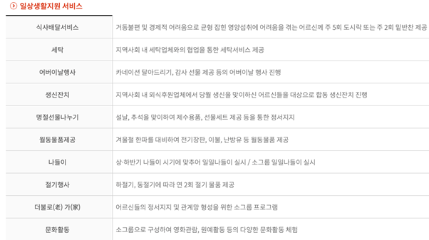
3. 간소화된 심사 절차
    -	기존 기관 서비스는 까다로운 심사 절차를 거쳐야 했지만, 이 플랫폼은 간소화된 심사 절차를 통해 신속하게 서비스를 제공받을 수 있습니다.
    -	서비스 제공을 희망하는 청년들은 간단한 인증 심사 절차를 통해 프로그램에 참여할 수 있습니다.
    -	Ex) 금정구 노인맞춤돌봄서비스 지원사업의 까다로운 대상 심사 <br> https://www.geumjeong.go.kr/index.geumjmenuCd=DOM_000000126005001004
    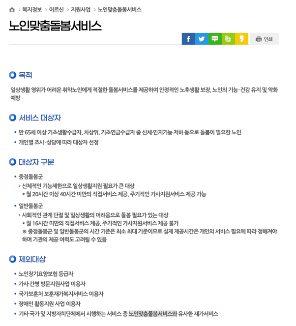
    -	Ex) 금정구노인복지관의 자원봉사 참여 프로세스 / https://www.geumjeongsilver.kr/support/sub2.php
        >	금정구노인복지관에 절차 소요 기간을 문의
    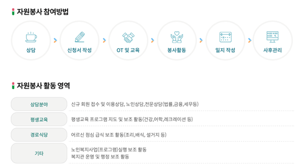
4.	시간적 제약 없는 서비스
    -	시니어와 청년의 매칭 시스템을 통해 양측이 원하는 시간을 조정하여 서비스를 이용할 수 있습니다.
    -	기존 기관 서비스는 제한적인 운영 시간으로 인해 이용에 어려움이 있었지만, 이 플랫폼은 24시간 언제든 서비스를 이용할 수 있습니다.
    -	Ex) 금정구종합사회복지관의 재가노인지원서비스센터 이용절차 / https://www.kumjungswc.or.kr/center/sub1.php
        >	금정구종합사회복지관에 절차 소요 기간을 문의
    
5.	비용 효율성
    - 기업 서비스의 경우 비용이 높았지만, 이 플랫폼은 이용자와 봉사자 간의 직접 연결을 통해 보다 저렴한 비용으로 서비스를 제공할 수 있습니다.
    -	간단한 저비용 돌봄 친구 서비스를 이용하기 위해서라도 고비용 전문 돌봄 서비스를 이용할 수밖에 없는 비용 구조로 부양 가구에는 서비스를 자주 이용하기에는 부담이 있습니다.
    -	Ex) (BAYADA)업체를 통한 방문요양 서비스 이용 요금 / https://www.geumjeong.go.kr/index.geumj?menuCd=DOM_000000126005001004
        >	공단부담과 본인부담으로 나누어져 있으며 가산 항목 / 서비스를 제공받을 수 있는 한도액(장기요양 등급별로 지정) -> 등급이 낮을 수록 한도액이 낮음
    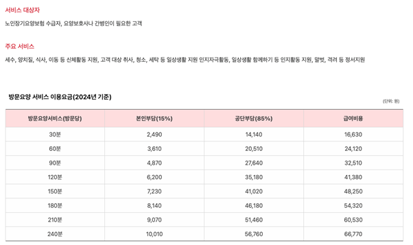
    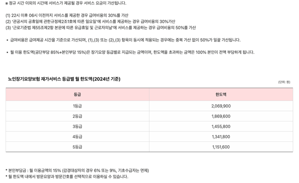
6. 청년들의 사회참여 유도
    -	우리나라는 빠르게 초고령사회에 진입하고 있습니다. 청년들의 적극적인 참여를 통해서 청년들은 사회적 책임감을 기르고, 시니어들은 필요한 서비스를 제공받을 수 있습니다.
    -	청년들과 노인들의 소통 기회 창출을 통해 청년들은 노인들의 경험과 지혜를 배우고 노인들은 청년들의 활력과 새로운 아이디어를 접할 수 있습니다. 이를 통해 세대 간 갈등을 완화하고 조화로운 사회를 구성할 수 있습니다.
    -	청년들은 활용 가능한 시간을 할애하여 서비스를 제공하므로 합당한 보상을 받게 됩니다. 이를 통해 학업과 생계에 도움이 될 수 있습니다.

<br/>

#### 1.5. 사회적가치 도입 계획
> 향후 서비스가 발전 됨에 따라 지역 사회와의 협력 관계를 구축하여, 공공 서비스와 연계된 프로그램을 개발할 수 있습니다. 세대간 화홥 조성을 위한 서비스 혹은 이러한 사회적 가치 창출에 개인이 좀 더 손쉽게 접근할 수 있도록 접근성을 높여  더 많은 사람들이 혜택을 받을 수 있도록 할 수 있습니다.
<br/>


### 2.상세설계
#### 2.1. 시스템 구성도
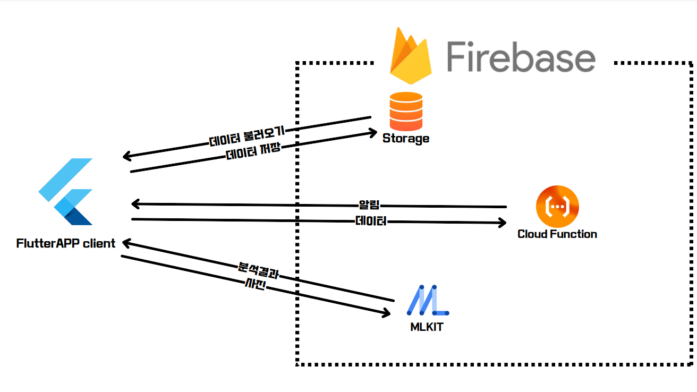
<br/>

#### 2.3. 사용기술
| 이름                  | 버전    |
|:---------------------:|:-------:|
| flutter             | 3.22.2  |
| cupertino_icons | 1.0.6 |
| firebase_core | 3.2.0 |
| firebase_auth | 5.1.2 |
| firebase_storage | 12.1.2 |
| cloud_firestore | 5.1.0 |
| provider | 6.0.0 |
| youtube_player_flutter | 8.0.0 |
| firebase_messaging | 15.0.3 |
| table_calendar | 3.1.2 |
| image_picker | 1.0.4 |
| image | 4.1.3 |
| google_mlkit_face_detection | 0.11.0 |
| google_mlkit_commons | 0.7.1 |
| tflite_flutter | 0.10.4 |
| flutter_email_sender | 6.0.3 |

<br/>


### 3. 개발결과
#### 3.1. 전체시스템 흐름도
- IA(Information Architecture)
  > 전체적인 시스템 구조의 정보를 간단히 도식화하여 보여줍니다. <br/>
  

- 시스템 플로우 차트
  > 테스크의 흐름과 이에 따른 데이터 처리를 도식화하여 보여줍니다.
  <br><br>
  참고) 시스템 플로우차트 컴포넌트
  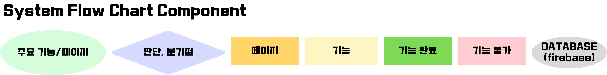<br>
  1. 시작 단계
      > 앱의 시작단계부터 회원가입 및 로그인을 거쳐 메인화면까지 도달하는 시스템 플로우차트입니다.
      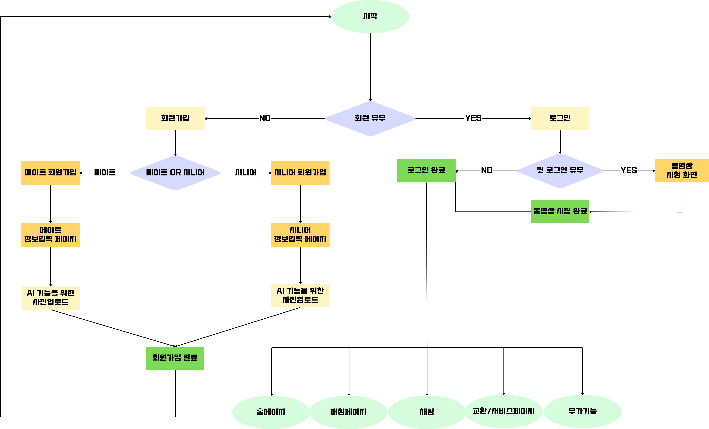

  2. 홈페이지
      > 앱의 홈페이지에서 다룰 수 있는 공고 쓰기와 열람, 매칭 신청등을 표기한 시스템 플로우차트입니다.
      

  3. 매칭페이지
      > 주고 받은 매칭을 관리하는 매칭페이지의 시스템 플로우차트입니다.
      

  4. 매칭후 활동
      > 진행되는 매칭에 대해 보고서 작성 중심으로 작동하는 앱의 매칭후 활동 시스템 플로우차트입니다.
      

  5. 교환페이지
      > 매이트가 매칭의 보상으로 받는 크래딧을 교환하는 교환페이지의 시스템 플로우차트입니다.
      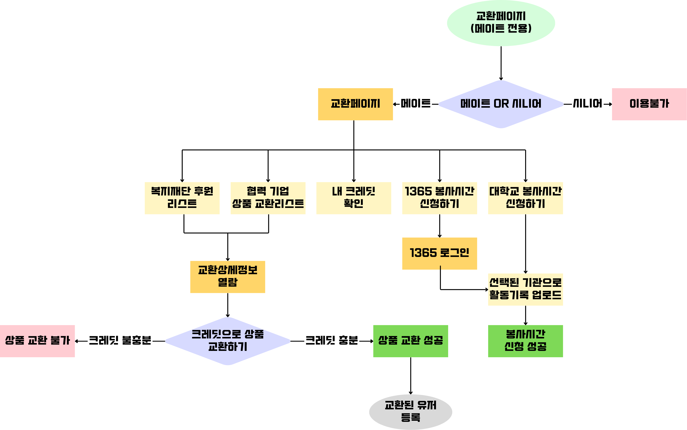

  6. 서비스페이지
      > 시니어가 받을 수 있는 유용한 서비스 정보를 모아서 손쉽게 볼 수 있는 서비스페이지의 시스템 플로우차트입니다.
      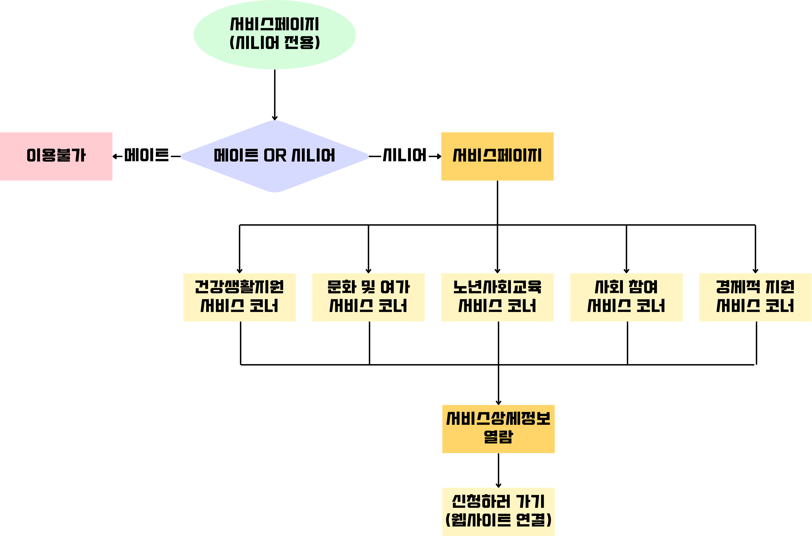
  
  7. 채팅페이지
      > 매칭등에 필요한 채팅기능을 담당하는 채팅페이지의 시스템 플로우차트입니다.
      

  8. 부가기능
      > 앱의 다양한 부가기능들을 정리한 부가기능 시스템 플로우차트입니다.
      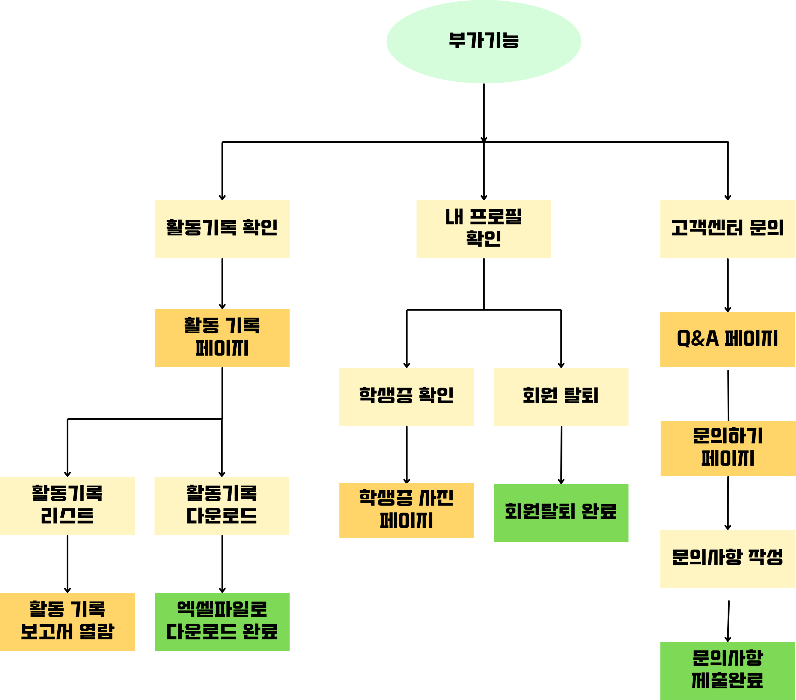
    <br>

- 유저 플로우차트
  > 시니어와 메이트 2가지 타입의 유저가 앱을 직접 사용했을 때의 행동흐름을 도식화하여 보여줍니다.
  1. 회원가입 유저 플로우차트
      > 유저타입별 회원가입시 행동흐름을 보여주는 플로우차트입니다.
      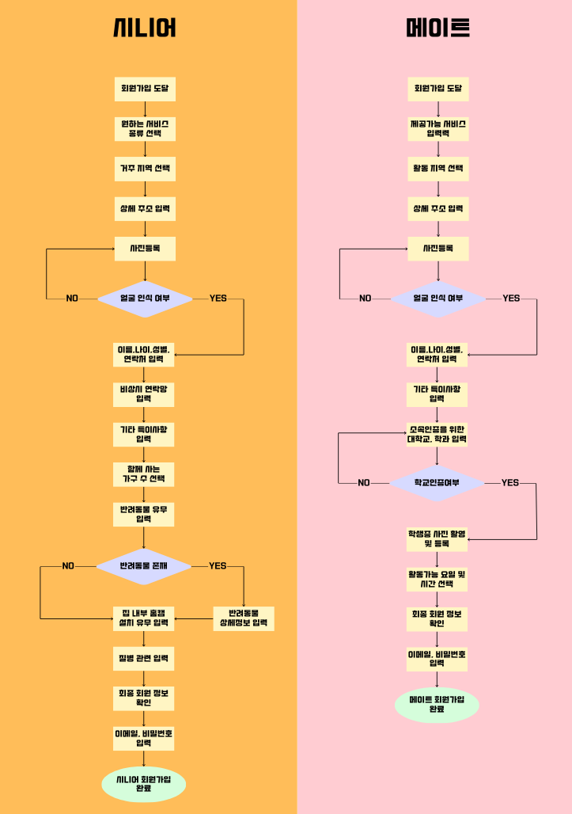<br>
  2. 매칭과 활동 유저 플로우차트
      > 유저타입별 매칭과 활동을 진행시 행동흐름을 보여주는 플로우차트입니다.
      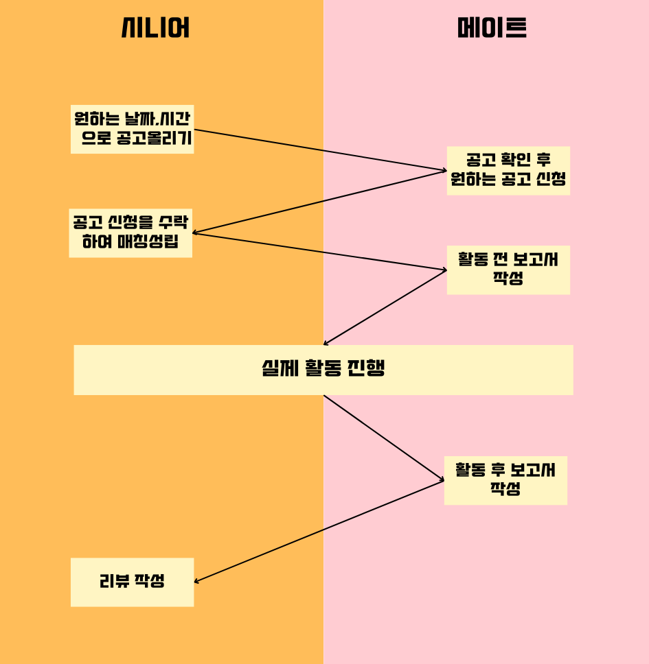
  <br>
  

<br/>

#### 3.2. 기능설명
##### ` 메인 페이지 `
- 상단 배너
  - 3초 마다 자동으로 내용이 넘어갑니다. <br/>
    

- 공지사항
  - 최근 5개의 공지사항을 보여줍니다.
  - 발행된지 일주일이 안 된 공지사항은 new라는 mark표시를 해줍니다.
  - 공지사항 글을 클릭하면 해당 공지사항 게시글로 이동합니다.
  - 상단의 더보기 버튼을 클릭하면 공지사항 페이지로 이동합니다.<br/>
    

- 이번 주 보너스 문제
  - 이번 주의 보너스 점수를 주는 문제를 보여줍니다.
  - 문제를 클릭하면, 해당 문제의 게시글로 이동합니다. <br/>
    

- 실시간 랭킹
  - 상위 랭킹 10명의 유저를 보여줍니다.
  - 상단의 더보기 버튼을 클릭하면 전체 랭킹 페이지로 이동합니다.<br/>
    
<br/>

##### ` 문제 페이지 `
- 문제 목록
  - 사용자가 설정한 한 번에 보여줄 문제 갯수 만큼 한 화면에 문제를 띄워줍니다.
  - 검색창에서 문제의 제목 및 번호로 문제를 검색할 수 있습니다.
  - 난이도, 영역, 카테고리 별로 문제를 볼 수 있습니다.
  - 상단의 shuffle 이모지를 클릭하면 랜덤으로 선택된 문제 푸는 페이지로 이동합니다.
  - 목록에서 문제를 클릭하면 해당 문제를 푸는 페이지로 이동합니다.
    
<br/>


#### 3.3. 기능명세서


|라벨|이름|상세|
|:---:|:----------------------------:|:---|
| S1  | 부산대학교 웹메일              | - 부산대 웹메일 형식인지 검증 <br/>- 중복되는 이메일인지 검증 |
| S2  | 부산대학교 웹메일 인증 코드 전송| - 클릭 시 인증 코드 메일로 전송 |
| S3  | 메일 인증 코드                 | - 인증 요청 버튼 클릭 후 활성화 <br/>- 유효시간 5분|
| S4  | 메일 인증 코드 확인            | - 인증코드 검증 |
| S5  | 닉네임                        | - 4 ~ 12자 영어, 숫자, '_' 가능 |
| S6  | 단과대학 선택                  | -부산대학교 단과대학 리스트 보여주기 |
| S7  | 학과 선택                     | - 단과대학 안의 학과 리스트 보여주기 |
| S8  | 비밀번호                      | - 입력 시 텍스트 보이지 않도록 •로 표현해주기 <br/>- 6자 이상 20자 이하, 영어와 숫자 조합 필수 |
| S9  | 비밀번호 확인                  | - 입력 시 텍스트 보이지 않도록 •로 표현해주기 <br/>- 비밀번호와 동일한 지 검증 |
| S10 | 회원가입 완료                  | - 비어 있는 입력 칸이 없는지 검증 <br/>-메일 인증 완료했는지 확인 <br/>-조건을 만족하면 회원가입 성공|
| S11 | 로그인                        | - 클릭 시 로그인 모달로 전환 |

<br/>

#### 3.4. 디렉토리 구조
```
├── docs/                       # 따시게 관련문서
├── function/                   # firebase function 설정 파일
├── WarmBoysApp/                # 따시게 flutter 프로젝트
│   ├── assets/                 # 이미지, 폰트, 아이콘 등의 정적 파일
│   ├── lib/                    # 소스코드
│   │   ├── screens/            # 실제 기능하는 주요 페이지들
│   │   ├── utils/              # 복잡한 기능, 연결등을 간소화 하는 함수파일모음
│   │   ├── widgets/             # 여러 페이지에서 사용되는 위젯 컴포넌트
│   │   ├── providers/          # firebase 로그인시 사용자 인증을 담당
│   ├── build/                  # 앱의 공통적인 설정과 파이어베이스 연결등을 담당
│   ├── android/                # 안드로이드 앱으로 빌드시 필요한 세팅 담당
│   ├── ios/                    # ios 앱으로 빌드시 필요한 세팅 담당
```
<br/>


### 4. 설치 및 사용 방법
**필요 패키지**
- 위의 사용 기술 참고

```bash
$ git clone https://github.com/pnusw-hackathon/PNUSW-2024-team-03.git
$ cd PNUSW-2024-team-03/WarmBoysApp
$ flutter pub get
$ flutter run # 가상모바일 디바이스 or 실제 휴대폰 usb디버깅(android/ios)
```
<br/>


### 5. 소개 및 시연영상
[](https://www.youtube.com/watch?v=EfEgTrm5_u4)

<br/>

### 6. 팀 소개

### 따뜻한 청년들2

| 안성수 | 홍태근 | 정솔빈 | 임정근 | 김상준 | 하수형 |
|:-------:|:-------:|:-------:|:-------:|:-------:|:-------:|
| |  |  |  |  |  
| member1@pusan.ac.kr | member2@gmail.com | member3@naver.com | member4@naver.com | member5@naver.com | member6@naver.com | 
| 정보컴퓨터공학과 <br/> 백엔드 개발 | IT응용공학과 <br/> 프론트엔드 개발 |  IT응용공학과 <br/> 프론트엔드 개발 | IT응용공학과 <br/> 기획 | 언어정보학과 <br/> 기획 | 기계공학과 <br/> 기획 | 

<br/>

### 7. 해커톤 참여 후기
- 안성수
    > 
- 홍태근
    > 
- 정솔빈
    > 
- 임정근
    >
- 김상준
    >
- 하수형
    >
